# rjs/shaping-skills

## Summary
rjs/shaping-skills is Ryan Singer’s public Claude Code skill pack for adapting Shape Up-style shaping and breadboarding to LLM-assisted project work. It matters for Self-OS because it offers a concrete pattern for turning conversations into framing/kickoff documents and for separating problem exploration, solution shaping, affordance mapping, and implementation handoff before code is written.

## Repository metadata
- Owner/repo: `rjs/shaping-skills`
- Description: Skills I use with Claude for shaping
- Default branch: `main`
- Created: 2026-01-29T11:48:29Z
- Pushed: 2026-04-10T10:12:59Z
- Stars: 1162
- Forks: 78
- Open issues: 8
- Language: Shell
- License: No license detected via GitHub API

## Key points
- Provides Claude Code skills for shaping and breadboarding, explicitly adapting Ryan Singer/Basecamp Shape Up methods to LLM-assisted work.
- Splits skills into document skills for collaborative transcript distillation (`/framing-doc`, `/kickoff-doc`) and solo/experimental skills for live shaping work (`/shaping`, `/breadboarding`, plus breadboard reflection).
- Strong warning from the README: these skills are GIGO; they format and distill but do not guarantee the input conversation is strategically sound.
- The workflow is directly relevant to Self-OS/taskOS because it can improve the “idea → shaped task → implementation handoff” transition before Codex/Claude agents start coding.
- The repository also includes a hook (`shaping-ripple.sh`) and GFM test script, suggesting the author uses the skills as operational Claude Code artifacts rather than just prompts.

## Skill inventory
| Path | Role | Notes |
|---|---|---|
| framing-doc/SKILL.md | Document skill | Turns conversation transcripts into a framing document: problem worth solving, why this problem, alternatives and rejected paths. |
| kickoff-doc/SKILL.md | Document skill | Turns a shaped project kickoff transcript into a builder-facing reference document for implementation. |
| shaping/SKILL.md | Solo shaping skill | Iterates on problem/requirements and solution shapes before implementation; separates needs from possible build shapes and runs fit checks. |
| breadboarding/skill.md | Solo breadboarding skill | Maps UI affordances, code affordances, and wiring in one view; useful for slicing vertical scopes. |
| breadboard-reflection/skill.md | Reflection skill | Reviews breadboards against shaping quality and implementation-readiness. |
| hooks/shaping-ripple.sh | Hook | Shell hook related to shaping workflow. |
| test-gfm.sh | Validation script | Checks GitHub-Flavored Markdown rendering/formatting assumptions. |

## Why it matters
This is a high-signal bridge between product-shaping practice and AI-agent execution. For Self-OS, it reinforces that not every idea should move straight to coding: good agent work needs a shaping layer that clarifies appetite, problem boundaries, affordances, risks, and builder handoff. The GIGO warning is especially important: these skills should be paired with adversarial review (`/grill-me`) or explicit quality checks, not treated as automatic truth-makers.

## Self-OS implications
- Potentially useful upstream of taskOS: use framing/kickoff-style documents to turn rough ideas into shaped tasks before creating Kanban implementation cards.
- Breadboarding maps well to Hermes “vertical slice” planning: UI affordances + code affordances + wiring gives agents clearer boundaries than generic feature specs.
- The transcript-to-document skills could improve meeting/conversation capture: raw transcript → framing doc → kickoff doc → implementation plan.
- Any adoption should preserve the GIGO caveat by adding a review pass that challenges whether the shaped problem is worth solving, not just whether the document is tidy.
- Consider comparing these skills with the existing Matt Pocock-inspired Self-OS shaping/PRD/issue flow before importing anything wholesale.

## File tree
- `.gitignore`
- `README.md`
- `breadboard-reflection/skill.md`
- `breadboarding/skill.md`
- `framing-doc/SKILL.md`
- `hooks/shaping-ripple.sh`
- `kickoff-doc/SKILL.md`
- `shaping/SKILL.md`
- `test-gfm.sh`

## Raw content
Full source files captured from the repository default branch at ingest time. Large skill files are included because this is a repo-as-workflow capture, not just a README bookmark.

### `README.md`

```markdown
# Shaping Skills

[Claude Code](https://claude.com/claude-code) skills for shaping and breadboarding — the methodology from [Shape Up](https://basecamp.com/shapeup) adapted for working with an LLM.

**Case study:** [Shaping 0-1 with Claude Code](https://x.com/rjs/status/2020184079350563263) walks through the full process of building a project from scratch using these skills. The source for that project is at [rjs/tick](https://github.com/rjs/tick).

## Skills

### Document skills — for collaborative work

These turn transcripts of real conversations into structured shaping documents. They're useful on real production projects where you're working with other people and want to capture what was said in a format you can act on.

**These are extremely GIGO (garbage in, garbage out).** They don't evaluate whether the material makes sense or is reasonable. They format and distill — that's it. When your inputs are good conversations with good thinking, they save a ton of time. When your inputs are bad, you get a nicely formatted bad document.

**`/framing-doc`** — Turn conversation transcripts into a framing document that captures the problem worth solving and why it was chosen over alternatives.

**`/kickoff-doc`** — Turn a shaped project kickoff transcript into a reference document for the builder, capturing what was shaped and agreed.

### Solo skills — more experimental

These are for working with Claude directly on shaping and design. They're more experimental and less battle-tested than the document skills.

**`/shaping`** — Iterate on both the problem (requirements) and solution (shapes) before committing to implementation. Separates what you need from how you might build it, with fit checks to see what's solved and what isn't.

**`/breadboarding`** — Map a system into UI affordances, code affordances, and wiring. Shows what users can do and how it works underneath — in one view. Good for slicing into vertical scopes.

## Install

```bash
# Clone the repo, then symlink each skill into your Claude Code skills directory
git clone https://github.com/rjs/shaping-skills.git ~/.local/share/shaping-skills
ln -s ~/.local/share/shaping-skills/framing-doc ~/.claude/skills/framing-doc
ln -s ~/.local/share/shaping-skills/kickoff-doc ~/.claude/skills/kickoff-doc
ln -s ~/.local/share/shaping-skills/breadboarding ~/.claude/skills/breadboarding
ln -s ~/.local/share/shaping-skills/shaping ~/.claude/skills/shaping
```

Each skill must be a direct child of `~/.claude/skills/` so Claude Code can discover it. Symlinks keep them updatable with `git pull`.

## Hook: Ripple Check

The repo includes a hook that reminds Claude to check for ripple effects when editing shaping documents. When Claude writes or edits a `.md` file with `shaping: true` in its frontmatter, the hook prompts a checklist — update affordance tables, fit checks, work streams, etc.

### Setup

1. Symlink the hook script:

```bash
mkdir -p ~/.claude/hooks
ln -s ~/.local/share/shaping-skills/hooks/shaping-ripple.sh ~/.claude/hooks/shaping-ripple.sh
```

2. Add the hook to your `~/.claude/settings.json`:

```json
{
  "hooks": {
    "PostToolUse": [
      {
        "matcher": "Write|Edit",
        "hooks": [
          {
            "type": "command",
            "command": "~/.claude/hooks/shaping-ripple.sh",
            "timeout": 5
          }
        ]
      }
    ]
  }
}
```

This fires after every `Write` or `Edit` tool call. It only activates for shaping documents (those with `shaping: true` frontmatter) — all other files pass through silently.

---

This README was written by [Claude Code](https://claude.com/claude-code).

```

### `framing-doc/SKILL.md`

```markdown
---
name: framing-doc
description: Create a framing document from conversation transcripts. Use when the user has transcripts (VTT, call notes, etc.) and wants to produce a frame that captures the problem worth solving and why it was chosen over alternatives.
---

# Framing from Conversation Transcripts

Produce a frame document from one or more conversation transcripts. The frame captures the "why" — what problem to solve and why this one, not the others.

---

## Before You Start

Ask the user:

1. **Which transcripts?** Get specific file paths. Read them in the order the user specifies — conversation order often matters because ideas build across calls.
2. **What's the topic area?** A rough sense of what these conversations were about (e.g., "AI features," "onboarding redesign") so you know what to listen for.

---

## What a Frame Document Contains

A frame has three sections:

### 1. Source — What was actually said

Capture verbatim quotes from the transcripts. This is ground truth. Everything else in the document is interpretation of this material.

- Attribute quotes to speakers
- Include enough context that the quote makes sense standalone
- Add brief connective tissue between quotes where needed, but keep your voice minimal

### 2. Pre-work — What options surfaced and why this one

Survey the landscape of options that came up across conversations. This is not background — it's the argument for why we're framing this particular problem.

For each option that surfaced:
- What is it?
- Who benefits?
- How strong is the signal? (How many people raised it independently? Did others pick it up or let it drop?)

Then make the case for the one to pursue now:
- Why is it more urgent or important than the others?
- Why not the others *right now*? (This is "why not now," not "why not ever" — don't dismiss ideas, just explain why they aren't the priority.)

**Do not invent a roadmap or sequence for the other options.** Whether and when they happen is a future decision. The only claim you're making is: this one first, for these reasons.

### 3. Problem / Outcome — The specific frame

**Problem:** What's broken, what pain exists. Render as bullets for easy scanning.

**Outcome:** What success looks like. Also bullets. Stay high-level — this is not solution-specific.

### 4. Less about / More about — Boundary on the solution space (optional)

A guardrail that orients the reader toward what kind of solution fits and away from what kind doesn't. It sits after Problem/Outcome as a separate section. Same format — two symmetric bullet lists.

**What it does:** Prevents someone from reading the Problem and Outcome correctly but proposing the wrong kind of solution. For example, a problem about getting programs into the system could reasonably lead someone to propose "AI that advises coaches on what to program" — which technically addresses the problem but completely misses the point.

**When to include it:** When there's a common misunderstanding or an obvious-but-wrong direction that people could easily head toward. The signal is that people in the conversations are actively drawing a line — saying what this is NOT. If nobody felt the need to draw that line, you probably don't need the section.

**How it surfaces:** This probably won't emerge mechanically from a first pass through the transcripts. It's more likely to surface during review — either the shaper notices a pattern of people saying "not about X," or someone reading the frame proposes something that fits the Problem/Outcome but misses the point. That's the moment where you realize the boundary needs to be made explicit.

**What it looks like:**

```markdown
## Less about

- [What this project is NOT trying to solve]
- [The wrong direction people might naturally head toward]

## More about

- [What kind of solution actually fits]
- [The real nature of the problem being addressed]
```

No quotes or attribution needed — it's a synthesis. Keep it to the key points.

---

## The Key Discipline: Evidence, Not Editorializing

After writing each line in Problem and Outcome, ask: **who said this, and where?**

- If you can point to a specific person and moment → keep it, cite it
- If it's directly implied by what someone said → keep it, mark it as implied with your reasoning
- If you can't trace it back → drop it

### Common traps to avoid

**Don't connect dots and present inferences as facts.** "Coaches bounce during trials because data entry is too hard" sounds plausible but if nobody said it, don't write it as established truth.

**Don't embellish for vividness.** Adding specificity that nobody stated ("every exercise, set, rep, and percentage") to make the problem sound more concrete is editorializing.

**Don't inflate the options list.** An idea that one person mentioned and nobody picked up is not an "option with traction." Be honest about signal strength. Ask yourself: did multiple people raise this independently? Did others build on it or let it die?

**Don't editorialize in the Problem statement.** Phrases like "TB has to earn the switch" or "the single biggest friction point" are rhetoric, not evidence. Make the case using what was said.

**Don't present your framing as their words.** Keep your interpretive voice separate from what was actually said. The Source section is theirs. Problem/Outcome are your distillation — and should be traceable back to Source.

---

## Reviewing the Frame

After drafting, examine every line in Problem and Outcome:

1. Read each bullet
2. Ask: what's my evidence for this claim?
3. If the evidence is a direct quote — cite it parenthetically
4. If the evidence is implied — say so explicitly
5. If there's no evidence — drop the line

Do the same for the pre-work options table. For each option listed, verify:
- Did it actually get traction in the conversations? (Multiple people, independently?)
- Or was it one person's idea that others didn't pick up?

Be willing to shrink the options list. Fewer real options are better than a padded list.

---

## Document Format

```markdown
---
shaping: true
---

# [Topic] — Frame

## Source

### [Speaker] ([Date])

> "Verbatim quote..."

> "Another quote..."

[Brief connective context where needed.]

### [Speaker] ([Date])

> "Verbatim quote..."

---

## Pre-work: [Topic] Options Landscape

[N] options surfaced with real traction across conversations:

| Option | What it does | Who benefits | Signal strength |
|--------|-------------|--------------|-----------------|
| **A. [Name]** | ... | ... | ... |
| **B. [Name]** | ... | ... | ... |

([Note on ideas that were mentioned but didn't get traction — dropped.])

**Why A now:** [Evidence-based argument for urgency/importance.]

---

## Problem

- [Bullet — traceable to source]
- [Bullet — traceable to source]

## Outcome

- [Bullet — high-level, not solution-specific]
- [Bullet — high-level, not solution-specific]

---

## Less about

- [What this is not]

## More about

- [What this is]
```

---

## What This Skill Does NOT Do

- **Does not shape solutions.** The frame is the "why." Shapes (the "how") come after, in a separate shaping doc.
- **Does not sequence future work.** It picks one thing as the priority now. It does not roadmap the rest.
- **Does not summarize conversations.** The Source section captures key quotes. The rest of the document is a distillation, not a summary.

```

### `kickoff-doc/SKILL.md`

```markdown
---
name: kickoff-doc
description: Turn a shaped project kickoff transcript into a reference document for the builder. Use when the user has a transcript (VTT, etc.) from a kickoff call and wants to produce a document that captures what was shaped and agreed.
---

# Kickoff Document from Transcript

Turn a kickoff call transcript into a builder-facing reference document for a shaped project.

---

## Before You Start

Ask the user:

1. **Who is the primary audience?** (Usually the builder who will implement the work.)
2. **What other inputs are there?** (Visuals, screenshots, mockups, breadboards from the session.)

The transcript is your source material. The document is NOT a summary of the call — it's a **map of the territory** that was shaped.

---

## Organizing Principle: Territory, Not Timeline

A kickoff transcript is sequential — people talk through things in the order they come up, circle back, go on tangents, get sidetracked by browser issues. Your job is to reconstruct the **territory they were describing**, not replay the conversation.

**Organize by the thing being built.** Each section should describe one area of the system fully — so the builder can look up "how does the Criteria tab work?" and find everything in one place.

**Do NOT organize by build sequence.** If the team identified slices (a sequence of vertical slices to build in order), those are managed separately — not in this document.

---

## Structure

The document has two top-level sections: **Frame** and **Shape**. Both are `##` headings. Their subsections are `###`.

### 1. Frame (`## Frame`)

The strategic context and boundary conditions. This is NOT fluff — the builder needs this to make judgment calls when they hit ambiguity.

- `### Problem` — Why this project, why now. What's broken or missing.
- `### Outcome` — The specific outcomes expected. What success looks like.

### 2. Shape (`## Shape`)

One `###` section per area of the system. For each area, describe:

- What it is and what's on the screen (affordances, components, data displayed)
- How it relates to other areas
- Design decisions that belong to THIS area — inline, not in a separate section
- Edge cases or flags that were called out
- What's temporary/placeholder vs. what's a real commitment

**Do NOT include a Build Sequence section.** Slices are tracked separately from this document.

---

## Voice: Use Their Words

The document is a record of shared understanding from the kickoff call.

### Do

- Use the actual words and phrases people used on the call
- Synthesize scattered discussion into clearer form (taking something said across several turns and stating it cleanly)
- Capture the reasoning people gave for decisions ("we're doing X because Y")

### Don't

- Put new ideas or conclusions in people's mouths
- Add motivational framing they didn't express ("each piece is a foundation, not a throwaway")
- Editorialize about importance or quality beyond what was said

### The Test

For every sentence, you should be able to point to a moment in the transcript where someone said it or clearly meant it. If you can't, either cut it or flag it as your own synthesis.

**Exception:** Editorializing that clarifies or synthesizes what was said IS fine. "The criteria screen is how filtering is expressed in the new world" — nobody said that exact sentence, but it accurately captures a point made across several turns. That's the job: make scattered discussion legible without adding your own conclusions.

---

## Design Decisions: Vertical, Not Horizontal

Do NOT create a grab-bag "Design Decisions" section. Instead, put each decision inline in the section where it matters.

- "Matches stored in DB not Redis" → goes in the section about matching
- "Candidates must be materialized before attachment" → goes in the section about attaching
- "Per-ICP match data as value objects" → goes in the section about match results

If a decision only matters when building one specific area, it belongs in that area's section. The builder shouldn't have to cross-reference a separate decisions list while working on a specific screen.

---

## Process

1. **Read the full transcript.** Don't start writing after reading part of it.
2. **Identify the areas of the system** that were discussed — these become your `###` sections under `## Shape`.
3. **Draft the Frame** (`## Frame` with `### Problem` and `### Outcome`) from the framing/outcomes discussion (usually near the start of the call).
4. **Write each Shape section** (`### ...`), pulling from wherever in the transcript that area was discussed. A single section may draw from moments scattered across the whole call.
5. **Place design decisions inline** in the section they belong to.
6. **Review against the transcript** — can you point to where each claim was said?

```

### `shaping/SKILL.md`

```markdown
---
name: shaping
description: Use this methodology when collaboratively shaping a solution with the user - iterating on problem definition (requirements) and solution options (shapes).
---

# Shaping Methodology

A structured approach for collaboratively defining problems and exploring solution options.

---

## Multi-Level Consistency (Critical)

Shaping produces documents at different levels of abstraction. **Truth must stay consistent across all levels.**

### The Document Hierarchy (high to low)

1. **Shaping doc** — ground truth for R's, shapes, parts, fit checks
2. **Slices doc** — ground truth for slice definitions, breadboards
3. **Individual slice plans** (V1-plan, etc.) — ground truth for implementation details

### The Principle

Each level summarizes or provides a view into the level(s) below it. Lower levels contain more detail; higher levels are designed views that help acquire context quickly.

**Changes ripple in both directions:**

- **Change at high level → trickles down:** If you change the shaping doc's parts table, update the slices doc too.
- **Change at low level → trickles up:** If a slice plan reveals a new mechanism or changes the scope of a slice, the Slices doc and shaping doc must reflect that.

### The Practice

Whenever making a change:

1. **Identify which level you're touching**
2. **Ask: "Does this affect documents above or below?"**
3. **Update all affected levels in the same operation**
4. **Never let documents drift out of sync**

The system only works if the levels are consistent with each other.

---

## Starting a Session

When kicking off a new shaping session, offer the user both entry points:

- **Start from R (Requirements)** — Describe the problem, pain points, or constraints. Build up requirements and let shapes emerge.
- **Start from S (Shapes)** — Sketch a solution already in mind. Capture it as a shape and extract requirements as you go.

There is no required order. Shaping is iterative — R and S inform each other throughout.

## Working with an Existing Shaping Doc

When the shaping doc already has a selected shape:

1. **Display the fit check for the selected shape only** — Show R × [selected shape] (e.g., R × F), not all shapes
2. **Summarize what is unsolved** — Call out any requirements that are Undecided, or where the selected shape has ❌

This gives the user immediate context on where the shaping stands and what needs attention.

---

## Core Concepts

### R: Requirements
A numbered set defining the problem space.

- **R0, R1, R2...** are members of the requirements set
- Requirements are negotiated collaboratively - not filled in automatically
- Track status: Core goal, Undecided, Leaning yes/no, Must-have, Nice-to-have, Out
- Requirements extracted from fit checks should be made standalone (not dependent on any specific shape)
- **R states what's needed, not what's satisfied** — satisfaction is always shown in a fit check (R × S)
- **Chunking policy:** Never have more than 9 top-level requirements. When R exceeds 9, group related requirements into chunks with sub-requirements (R3.1, R3.2, etc.) so the top level stays at 9 or fewer. This keeps the requirements scannable and forces meaningful grouping.

### S: Shapes (Solution Options)
Letters represent mutually exclusive solution approaches.

- **A, B, C...** are top-level shape options (you pick one)
- **C1, C2, C3...** are components/parts of Shape C (they combine)
- **C3-A, C3-B, C3-C...** are alternative approaches to component C3 (you pick one)

### Shape Titles
Give shapes a short descriptive title that characterizes the approach. Display the title when showing the shape:

```markdown
## E: Modify CUR in place to follow S-CUR

| Part | Mechanism |
|------|-----------|
| E1 | ... |
```

Good titles capture the essence of the approach in a few words:
- ✅ "E: Modify CUR in place to follow S-CUR"
- ✅ "C: Two data sources with hybrid pagination"
- ❌ "E: The solution" (too vague)
- ❌ "E: Add search to widget-grid by swapping..." (too long)

### Notation Hierarchy

| Level | Notation | Meaning | Relationship |
|-------|----------|---------|--------------|
| Requirements | R0, R1, R2... | Problem constraints | Members of set R |
| Shapes | A, B, C... | Solution options | Pick one from S |
| Components | C1, C2, C3... | Parts of a shape | Combine within shape |
| Alternatives | C3-A, C3-B... | Approaches to a component | Pick one per component |

### Notation Persistence
Keep notation throughout as an audit trail. When finalizing, compose new options by referencing prior components (e.g., "Shape E = C1 + C2 + C3-A").

## Phases

Shaping moves through two phases:

```
Shaping → Slicing
```

| Phase | Purpose | Output |
|-------|---------|--------|
| **Shaping** | Explore the problem and solution space, select and detail a shape | Shaping doc with R, shapes, fit checks, breadboard |
| **Slicing** | Break down for implementation | Vertical slices with demo-able UI |

### Phase Transition

**Shaping → Slicing** happens when:
- A shape is selected (passes fit check, feels right)
- The shape has been breadboarded into concrete affordances
- We need to plan implementation order

You can't slice without a breadboarded shape.

---

## Fit Check (Decision Matrix)

THE fit check is the single table comparing all shapes against all requirements. Requirements are rows, shapes are columns. This is how we decide which shape to pursue.

### Format

```markdown
## Fit Check

| Req | Requirement | Status | A | B | C |
|-----|-------------|--------|---|---|---|
| R0 | Make items searchable from index page | Core goal | ✅ | ✅ | ✅ |
| R1 | State survives page refresh | Must-have | ✅ | ❌ | ✅ |
| R2 | Back button restores state | Must-have | ❌ | ✅ | ✅ |

**Notes:**
- A fails R2: [brief explanation]
- B fails R1: [brief explanation]
```

### Conventions
- **Always show full requirement text** — never abbreviate or summarize requirements in fit checks
- **Fit check is BINARY** — Use ✅ for pass, ❌ for fail. No other values.
- **Shape columns contain only ✅ or ❌** — no inline commentary; explanations go in Notes section
- **Never use ⚠️ or other symbols in fit check** — ⚠️ belongs only in the Parts table's flagged column
- Keep notes minimal — just explain failures

### Comparing Alternatives Within a Component

When comparing alternatives for a specific component (e.g., C3-A vs C3-B), use the same format but scoped to that component:

```markdown
## C3: Component Name

| Req | Requirement | Status | C3-A | C3-B |
|-----|-------------|--------|------|------|
| R1 | State survives page refresh | Must-have | ✅ | ❌ |
| R2 | Back button restores state | Must-have | ✅ | ✅ |
```

### Missing Requirements
If a shape passes all checks but still feels wrong, there's a missing requirement. Articulate the implicit constraint as a new R, then re-run the fit check.

### Macro Fit Check

A separate tool from the standard fit check, used when working at a high level with chunked requirements and early-stage shapes where most mechanisms are still ⚠️. Use when explicitly requested.

The macro fit check has two columns per shape instead of one:

- **Addressed?** — Does some part of the shape seem to speak to this requirement at a high level?
- **Answered?** — Can you trace the concrete how? Is the mechanism actually spelled out?

**Format:**

```markdown
## Macro Fit Check: R × A

| Req | Requirement | Addressed? | Answered? |
|-----|-------------|:----------:|:---------:|
| R0 | Core goal description | ✅ | ❌ |
| R1 | Guided workflow | ✅ | ❌ |
| R2 | Agent boundary | ⚠️ | ❌ |
```

**Conventions:**
- Only show top-level requirements (R0, R1, R2...), not sub-requirements
- **No notes column** — keep the table narrow and scannable
- Use ✅ (yes), ⚠️ (partially), ❌ (no) for Addressed
- Use ✅ (yes) or ❌ (no) for Answered
- Follow the macro fit check with a separate **Gaps** table listing specific missing parts and their related sub-requirements

## Possible Actions

These can happen in any order:

- **Populate R** - Gather requirements as they emerge
- **Sketch a shape** - Propose a high-level approach (A, B, C...)
- **Detail (components)** - Break a shape into components (B1, B2...)
- **Detail (affordances)** - Expand a selected shape into concrete UI/Non-UI affordances and wiring
- **Explore alternatives** - For a component, identify options (C3-A, C3-B...)
- **Check fit** - Build a fit check (decision matrix) playing options against R
- **Extract Rs** - When fit checks reveal implicit requirements, add them to R as standalone items
- **Breadboard** - Map the system to understand where changes happen and make the shape more concrete
- **Spike** - Investigate unknowns to identify concrete steps needed
- **Decide** - Pick alternatives, compose final solution
- **Slice** - Break a breadboarded shape into vertical slices for implementation

## Communication

### Show Full Tables

When displaying R (requirements) or any S (shapes), always show every row — never summarize or abbreviate. The full table is the artifact; partial views lose information and break the collaborative process.

- Show all requirements, even if many
- Show all shape parts, including sub-parts (E1.1, E1.2...)
- Show all alternatives in fit checks

### Why This Matters

Shaping is collaborative negotiation. The user needs to see the complete picture to:
- Spot missing requirements
- Notice inconsistencies
- Make informed decisions
- Track what's been decided

Summaries hide detail and shift control away from the user.

### Mark Changes with 🟡

When re-rendering a requirements table or shape table after making changes, mark every changed or added line with a 🟡 so the user can instantly spot what's different. Place the 🟡 at the start of the changed cell content. This makes iterative refinement easy to follow — the user should never have to diff the table mentally.

## Spikes

A spike is an investigation task to learn how the existing system works and what concrete steps are needed to implement a component. Use spikes when there's uncertainty about mechanics or feasibility.

### File Management

**Always create spikes in their own file** (e.g., `spike.md` or `spike-[topic].md`). Spikes are standalone investigation documents that may be shared or worked on independently from the shaping doc.

### Purpose

- Learn how the existing system works in the relevant area
- Identify **what we would need to do** to achieve a result
- Enable informed decisions about whether to proceed
- Not about effort — effort is implicit in the steps themselves
- **Investigate before proposing** — discover what already exists; you may find the system already satisfies requirements

### Structure

```markdown
## [Component] Spike: [Title]

### Context
Why we need this investigation. What problem we're solving.

### Goal
What we're trying to learn or identify.

### Questions

| # | Question |
|---|----------|
| **X1-Q1** | Specific question about mechanics |
| **X1-Q2** | Another specific question |

### Acceptance
Spike is complete when all questions are answered and we can describe [the understanding we'll have].
```

### Acceptance Guidelines

Acceptance describes the **information/understanding** we'll have, not a conclusion or decision:

- ✅ "...we can describe how users set their language and where non-English titles appear"
- ✅ "...we can describe the steps to implement [component]"
- ❌ "...we can answer whether this is a blocker" (that's a decision, not information)
- ❌ "...we can decide if we should proceed" (decision comes after the spike)

The spike gathers information; decisions are made afterward based on that information.

### Question Guidelines

Good spike questions ask about mechanics:
- "Where is the [X] logic?"
- "What changes are needed to [achieve Y]?"
- "How do we [perform Z]?"
- "Are there constraints that affect [approach]?"

Avoid:
- Effort estimates ("How long will this take?")
- Vague questions ("Is this hard?")
- Yes/no questions that don't reveal mechanics

## Breadboards

Use the `/breadboarding` skill to map existing systems or detail a shape into concrete affordances. Breadboarding produces:
- UI Affordances table
- Non-UI Affordances table
- Wiring diagram grouped by Place

Invoke breadboarding when you need to:
- Map existing code to understand where changes land
- Translate a high-level shape into concrete affordances
- Reveal orthogonal concerns (parts that are independent of each other)

### Tables Are the Source of Truth

The affordance tables (UI and Non-UI) define the breadboard. The Mermaid diagram renders them.

When receiving feedback on a breadboard:
1. **First** — update the affordance tables (add/remove/modify affordances, update Wires Out)
2. **Then** — update the Mermaid diagram to reflect those changes

Never treat the diagram as the primary artifact. Changes flow from tables → diagram, not the reverse.

### CURRENT as Reserved Shape Name

Use **CURRENT** to describe the existing system. This provides a baseline for understanding where proposed changes fit.

## Shape Parts

### Flagged Unknown (⚠️)

A mechanism can be described at a high level without being concretely understood. The **Flag** column tracks this:

| Part | Mechanism | Flag |
|------|-----------|:----:|
| **F1** | Create widget (component, def, register) | |
| **F2** | Magic authentication handler | ⚠️ |

- **Empty** = mechanism is understood — we know concretely how to build it
- **⚠️** = flagged unknown — we've described WHAT but don't yet know HOW

**Why flagged unknowns fail the fit check:**

1. **✅ is a claim of knowledge** — it means "we know how this shape satisfies this requirement"
2. **Satisfaction requires a mechanism** — some part that concretely delivers the requirement
3. **A flag means we don't know how** — we've described what we want, not how to build it
4. **You can't claim what you don't know** — therefore it must be ❌

Fit check is always binary — ✅ or ❌ only. There is no third state. A flagged unknown is a failure until resolved.

This distinguishes "we have a sketch" from "we actually know how to do this." Early shapes (A, B, C) often have many flagged parts — that's fine for exploration. But a selected shape should have no flags (all ❌ resolved), or explicit spikes to resolve them.

### Parts Must Be Mechanisms

Shape parts describe what we BUILD or CHANGE — not intentions or constraints:

- ✅ "Route `childType === 'letter'` to `typesenseService.rawSearch()`" (mechanism)
- ❌ "Types unchanged" (constraint — belongs in R)

### Avoid Tautologies Between R and S

**R** states the need/constraint (what outcome). **S** describes the mechanism (how to achieve it). If they say the same thing, the shape part isn't adding information.

- ❌ R17: "Admins can bulk request members to sign" + C6.3: "Admin can bulk request members to sign"
- ✅ R17: "Admins can bring existing members into waiver tracking" + C6.3: "Bulk request UI with member filters, creates WaiverRequests in batch"

The requirement describes the capability needed. The shape part describes the concrete mechanism that provides it. If you find yourself copying text from R into S, stop — the shape part should add specificity about *how*.

### Parts Should Be Vertical Slices

Avoid horizontal layers like "Data model" that group all tables together. Instead, co-locate data models with the features they support:

- ❌ **B4: Data model** — Waivers table, WaiverSignatures table, WaiverRequests table
- ✅ **B1: Signing handler** — includes WaiverSignatures table + handler logic
- ✅ **B5: Request tracking** — includes WaiverRequests table + tracking logic

Each part should be a vertical slice containing the mechanism AND the data it needs.

### Extract Shared Logic

When the same logic appears in multiple parts, extract it as a standalone part that others reference:

- ❌ Duplicating "Signing handler: create WaiverSignature + set boolean" in B1 and B2
- ✅ Extract as **B1: Signing handler**, then B2 and B3 say "→ calls B1"

```markdown
| **B1** | **Signing handler** |
| B1.1 | WaiverSignatures table: memberId, waiverId, signedAt |
| B1.2 | Handler: create WaiverSignature + set member.waiverUpToDate = true |
| **B2** | **Self-serve signing** |
| B2 | Self-serve purchase: click to sign inline → calls B1 |
| **B3** | **POS signing via email** |
| B3.1 | POS purchase: send waiver email |
| B3.2 | Passwordless link to sign → calls B1 |
```

### Hierarchical Notation

Start with flat notation (E1, E2, E3...). Only introduce hierarchy (E1.1, E1.2...) when:

- There are too many parts to easily understand
- You're reaching a conclusion and want to show structure
- Grouping related mechanisms aids communication

| Notation | Meaning |
|----------|---------|
| E1 | Top-level component of shape E |
| E1.1, E1.2 | Sub-parts of E1 (add later if needed) |

Example of hierarchical grouping (used when shape is mature):

| Part | Mechanism |
|------|-----------|
| **E1** | **Swap data source** |
| E1.1 | Modify backend indexer |
| E1.2 | Route letters to new service |
| E1.3 | Route posts to new service |
| **E2** | **Add search input** |
| E2.1 | Add input with debounce |

## Detailing a Shape

When a shape is selected, you can expand it into concrete affordances. This is called **detailing**.

### Notation

Use "Detail X" (not a new letter) to show this is a breakdown of Shape X, not an alternative:

```markdown
## A: First approach
(shape table)

## B: Second approach
(shape table)

## Detail B: Concrete affordances
(affordance tables + wiring)
```

### What Detailing Produces

Use the `/breadboarding` skill to produce:
- **UI Affordances table** — Things users see and interact with (inputs, buttons, displays)
- **Non-UI Affordances table** — Data stores, handlers, queries, services
- **Wiring diagram** — How affordances connect across places

### Why "Detail X" Not "C"

Shape letters (A, B, C...) are **mutually exclusive alternatives** — you pick one. Detailing is not an alternative; it's a deeper breakdown of the selected shape. Using a new letter would incorrectly suggest it's a sibling option.

```
A, B, C = alternatives (pick one)
Detail B = expansion of B (not a choice)
```

## Documents

Shaping produces up to four documents. Each has a distinct role:

| Document | Contains | Purpose |
|----------|----------|---------|
| **Frame** | Source, Problem, Outcome | The "why" — concise, stakeholder-level |
| **Shaping doc** | Requirements, Shapes (CURRENT/A/B/...), Affordances, Breadboard, Fit Check | The working document — exploration and iteration happen here |
| **Slices doc** | Slice details, affordance tables per slice, wiring diagrams | The implementation plan — how to build incrementally |
| **Slice plans** | V1-plan.md, V2-plan.md, etc. | Individual implementation plans for each slice |

### Document Lifecycle

```
Frame (problem/outcome)
    ↓
Shaping (explore, detail, breadboard)
    ↓
Slices (plan implementation)
```

**Frame** can be written first — it captures the "why" before any solution work begins. It contains:
- **Source** — Original requests, quotes, or material that prompted the work (verbatim)
- **Problem** — What's broken, what pain exists (distilled from source)
- **Outcome** — What success looks like (high-level, not solution-specific)

### Capturing Source Material

When the user provides source material during framing (user requests, quotes, emails, slack messages, etc.), **always capture it verbatim** in a Source section at the top of the frame document.

```markdown
## Source

> I'd like to ask again for your thoughts on a user scenario...
>
> Small reminder: at the moment, if I want to keep my country admin rights
> for Russia and Crimea while having Europe Center as my home center...

> [Additional source material added as received]

---

## Problem
...
```

**Why this matters:**
- The source is the ground truth — Problem/Outcome are interpretations
- Preserves context that may be relevant later
- Allows revisiting the original request if the distillation missed something
- Multiple sources can be added as they arrive during framing

**When to capture:**
- User pastes a request or quote
- User shares an email or message from a stakeholder
- User describes a scenario they were told about
- Any raw material that informs the frame

**Shaping doc** is where active work happens. All exploration, requirements gathering, shape comparison, breadboarding, and fit checking happens here. This is the working document and ground truth for R, shapes, parts, and fit checks.

**Slices doc** is created when the selected shape is breadboarded and ready to build. It contains the slice breakdown, affordance tables per slice, and detailed wiring.

### File Management

- **Shaping doc**: Update freely as you iterate — this is the ground truth
- **Slices doc**: Created when ready to slice, updated as slice scope clarifies
- **Slice plans**: Individual files (V1-plan.md, etc.) with implementation details

### Frontmatter

Every shaping document (shaping doc, frame, slices doc) must include `shaping: true` in its YAML frontmatter. This enables tooling hooks (e.g., ripple-check reminders) that help maintain consistency across documents.

```markdown
---
shaping: true
---

# [Feature Name] — Shaping
...
```

### Keeping Documents in Sync

See **Multi-Level Consistency** at the top of this document. Changes at any level must ripple to affected levels above and below.

## Slicing

After a shape is breadboarded, slice it into vertical implementation increments. Use the `/breadboarding` skill for the slicing process — it defines what vertical slices are, the procedure for creating them, and visualization formats.

**The flow:**
1. **Parts** → high-level mechanisms in the shape
2. **Breadboard** → concrete affordances with wiring (use `/breadboarding`)
3. **Slices** → vertical increments that can each be demoed (use `/breadboarding` slicing section)

**Key principle:** Every slice must end in demo-able UI. A slice without visible output is a horizontal layer, not a vertical slice.

**Document outputs:**
- **Slices doc** — slice definitions, per-slice affordance tables, sliced breadboard
- **Slice plans** — individual implementation plans (V1-plan.md, V2-plan.md, etc.)

## Example

User is shaping a search feature:

```markdown
---
shaping: true
---

## Requirements (R)

| ID | Requirement | Status |
|----|-------------|--------|
| R0 | Make items searchable from index page | Core goal |
| R1 | State survives page refresh | Undecided |
| R2 | Back button restores state | Undecided |

---

## C2: State Persistence

| Req | Requirement | Status | C2-A | C2-B | C2-C |
|-----|-------------|--------|------|------|------|
| R0 | Make items searchable from index page | Core goal | — | — | — |
| R1 | State survives page refresh | Undecided | ✅ | ✅ | ❌ |
| R2 | Back button restores state | Undecided | ✅ | ✅ | ✅ |

**Notes:**
- C2-C fails R1: in-memory state lost on refresh
- C2-B satisfies R2 but requires custom popstate handler
```

```

### `breadboarding/skill.md`

```markdown
---
name: breadboarding
description: Transform a workflow description into affordance tables showing UI and Code affordances with their wiring. Use to map existing systems or design new ones from shaped parts.
---

# Breadboarding

Breadboarding transforms a workflow description into a complete map of affordances and their relationships. The output is always a set of tables showing numbered UI and Code affordances with their Wires Out and Returns To relationships. The tables are the truth. Mermaid diagrams are optional visualizations for humans.

---

## Use Cases

Breadboarding serves two functions:

### 1. Mapping an Existing System

You don't understand how an existing system works in its concrete details. You have a workflow you're trying to understand — explaining how something happens or why something doesn't happen.

**Input:**
- Code repo(s) to analyze
- Workflow description (always from the perspective of an operator trying to make an effect happen — through UI or as a caller)

**Output:**
- UI Affordances table
- Code Affordances table
- (Optional) Mermaid visualization

**Note:** If the workflow spans multiple applications (frontend + backend), create ONE breadboard that tells the full story. Label places to show which system they belong to.

### 2. Designing from Shaped Parts

You have a new system sketched as an assembly of parts (mechanisms) per shaping. You need to detail out the concrete mechanism and show how those parts interact as a system.

**Input:**
- Parts list (mechanisms from shaping)
- The R (requirement/outcome) the parts are meant to achieve
- Existing system (optional) — if the new parts must interoperate with existing code

**Output:**
- UI Affordances table
- Code Affordances table
- (Optional) Mermaid visualization

### Mixtures

Often you have both: an existing system that must remain as-is, plus new pieces or changes defined in a shape. In this case, breadboard both together — the existing affordances and the new ones — showing how they connect.

### 3. Reading a Whiteboard Breadboard

Hand-drawn or whiteboard breadboards use a visual stacking format rather than tables. The same concepts apply (Places, affordances, wiring) but the layout conventions differ.

**Visual conventions:**

| Element | How it appears |
|---------|---------------|
| **Place** | Colored block (often pink/purple) at the **top** of a vertical stack |
| **Affordances in a place** | Blocks stacked **underneath** the place block — containment is shown by vertical position in the stack |
| **Code affordances** | Typically float **between** place stacks, not inside them |
| **Place loader** | A code affordance positioned at the **top-left** of the place block — describes the data/inputs needed to render that place |
| **Wires Out** | Solid arrows between blocks |
| **Returns To** | Dashed arrows between blocks |
| **Conditionals** | Indented blocks within a stack, often a different color (e.g., green), showing if/else branches |
| **Place references** | `_` prefix on a place name within a stack (same as `_PlaceName` convention) |
| **Uncertain/tentative** | `?` prefix or `~` prefix on an affordance name, or dashed borders — indicates the affordance is speculative |
| **Containing box** | A large boundary drawn around multiple stacks — groups affordances by system or responsibility boundary (e.g., "HireEZ" box) |
| **Notes/annotations** | Freeform text near elements — context, open questions, or rationale |

**How to read a whiteboard breadboard:**

1. **Identify places** — Find the colored header blocks at the top of each stack
2. **Read each stack top-to-bottom** — Everything stacked under a place belongs to that place
3. **Find loaders** — Code affordances at the top-left of a place block describe what data is needed to render
4. **Trace wiring** — Follow arrows between stacks for control flow (solid) and data flow (dashed)
5. **Note conditionals** — Indented blocks with different colors show branching logic within a place
6. **Check containing boxes** — Large boundaries indicate system/responsibility boundaries
7. **Flag speculative items** — `?` and `~` prefixed items are uncertain and may not survive shaping

**Translating to tables:** When converting a whiteboard breadboard to standard affordance tables, map each stack to its Place, enumerate the affordances top-to-bottom, and capture the arrows as Wires Out / Returns To relationships. Loaders become code affordances with Returns To pointing at the UI affordances they feed.

---

## Core Concepts

### Places

A Place is a **bounded context of interaction**. While you're in a Place:
- You have a specific set of affordances available to you
- You **cannot** interact with affordances outside that boundary
- You must take an action to leave

**Place is perceptual, not technical.** It's not about URLs or components — it's about what the user experiences as their current context. A Place is "where you are" in terms of what you can do right now.

#### The Blocking Test

The simplest test for whether something is a different Place: **Can you interact with what's behind?**

| Answer | Meaning |
|--------|---------|
| **No** | You're in a different Place |
| **Yes** | Same Place, with local state changes |

#### Examples

| UI Element | Blocking? | Place? | Why |
|------------|-----------|--------|-----|
| Modal | Yes | Yes | Can't interact with page behind |
| Confirmation popover | Yes | Yes | Must respond before returning (limit case of modal) |
| Edit mode (whole screen transforms) | Yes | Yes | All affordances changed |
| Checkbox reveals extra fields | No | No | Surroundings unchanged |
| Dropdown menu | No | No | Can click away, non-blocking |
| Tooltip | No | No | Informational, non-blocking |

#### Local State vs Place Navigation

When a control changes state, ask: did *everything* change, or just a subset while the surroundings stayed the same?

| Type | What happens | How to model |
|------|--------------|--------------|
| **Local state** | Subset of UI changes, surroundings unchanged | Same Place, conditional N → dependent Us |
| **Place navigation** | Entire screen transforms, or blocking overlay | Different Places |

#### Mode-Based Places

When a mode (like "edit mode") transforms the entire screen — different buttons, different affordances everywhere — model as separate Places:

```
PLACE: CMS Page (Read Mode)
PLACE: CMS Page (Edit Mode)
```

The state flag (e.g., `editMode$`) that switches between them is a **navigation mechanism**, not a data store. Don't include it as an S in either Place.

#### Three Questions for Any Control

For any UI affordance, ask:
1. Where did I come from to see this?
2. Where am I now?
3. Where do I go if I act on it?

If the answer to #3 is "everything changes" or "I can't interact with what's behind until I respond," that's navigation to a different Place.

#### Labeling Conventions

| Pattern | Use |
|---------|-----|
| `PLACE: Page Name` | Standard page/route |
| `PLACE: Page Name (Mode)` | Mode-based variant of a page |
| `PLACE: Modal Name` | Modal dialog |
| `PLACE: Backend` | API/database boundary |

When spanning multiple systems, label with the system: `PLACE: Checkout Page (frontend)`, `PLACE: Payment API (backend)`.

### Place IDs

Places are first-class elements in the data model. Each Place gets an ID:

| # | Place | Description |
|---|-------|-------------|
| P1 | CMS Page (Read Mode) | View-only state |
| P2 | CMS Page (Edit Mode) | Editing state with page-level controls |
| P2.1 | widget-grid (letters) | Subplace: letter editing widget within P2 |
| P3 | Letter Form Modal | Form for adding/editing letters |
| P4 | Backend | API resolvers and database |

Place IDs enable:
- **Explicit navigation wiring** — wire `→ P2` instead of to an affordance inside
- **Containment tracking** — each affordance declares which Place it belongs to
- **Consistent Mermaid subgraphs** — subgraph ID matches Place ID

### Place References

When a nested place has lots of internal affordances and would clutter the parent, you can **detach** it:

1. Put a **reference node** in the parent place using underscore prefix: `_letter-browser`
2. Define the full place separately with all its internals
3. Wire from the reference to the place: `_letter-browser --> letter-browser`

The reference is a **UI affordance** — it represents "this widget/component renders here" in the parent context.

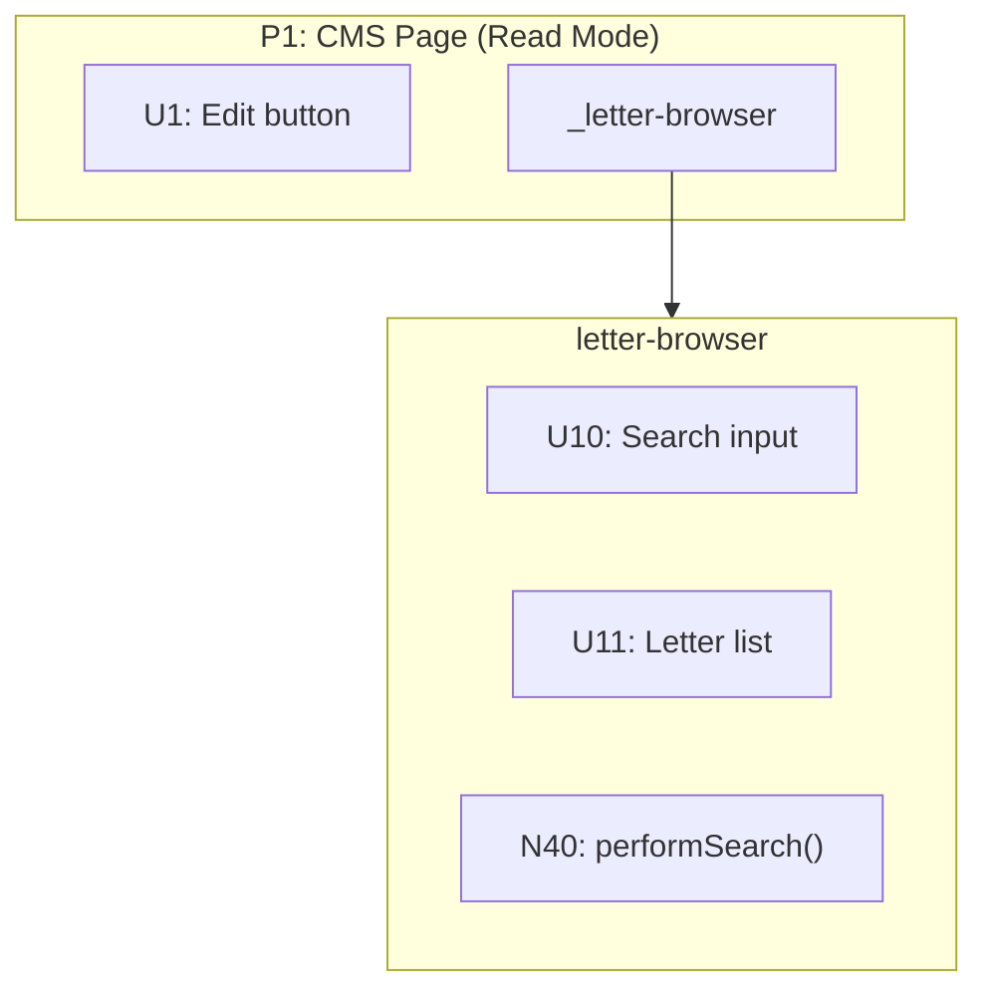

In affordance tables, list the reference as a UI affordance:

| # | Affordance | Control | Wires Out |
|---|------------|---------|-----------|
| U1 | Edit button | click | → N1 |
| _letter-browser | Widget reference | — | → P3 |

Style place references with a dashed border to distinguish them:
```
classDef placeRef fill:#ffb6c1,stroke:#d87093,stroke-width:2px,stroke-dasharray:5 5
class U_LB placeRef
```

### Modes as Places

When a component has distinct modes (read vs edit, viewing vs editing, collapsed vs expanded), model them as **separate places** — they're different perceptual states for the user.

If one mode includes everything from another plus more, show this with a **place reference** inside the extended place:

```
P3: letter-browser (Read)    — base state
P4: letter-browser (Edit)    — contains _letter-browser (Read) + new affordances
```

The reference shows composition: "everything in P3 appears here, plus these additions."

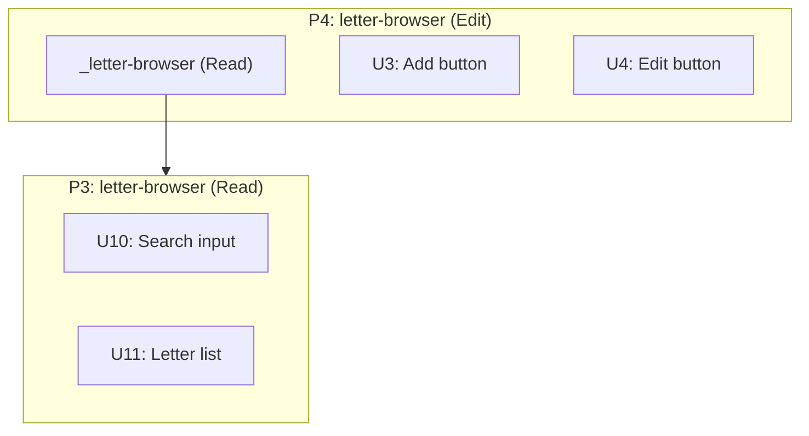

In affordance tables for P4, the reference shows inheritance:

| # | Affordance | Control | Wires Out | Notes |
|---|------------|---------|-----------|-------|
| _letter-browser (Read) | Inherits all of P3 | — | → P3 | |
| U3 | Add button | click | → N3 | NEW |
| U4 | Edit button | click | → N4 | NEW |

### Subplaces

A **subplace** is a defined subset of a Place — a contained area that groups related affordances. Use subplaces when:
- A Place contains multiple distinct widgets or sections
- You're detailing one part of a larger Place
- You want to show what's in scope vs out of scope

**Notation:** Use hierarchical IDs — `P2.1`, `P2.2`, etc. for subplaces of P2.

```
| # | Place | Description |
|---|-------|-------------|
| P2 | Dashboard | Main dashboard page |
| P2.1 | Sales widget | Subplace: sales metrics |
| P2.2 | Activity feed | Subplace: recent activity |
```

In affordance tables, use the subplace ID to show containment:

```
| U3 | P2.1 | sales-widget | "Refresh" button | click | → N4 | — |
| U7 | P2.2 | activity-feed | activity list | render | — | — |
```

**In Mermaid:** Nest the subplace subgraph inside the parent. Use the same background color (no distinct fill) — the subplace is part of the parent, not a separate Place:

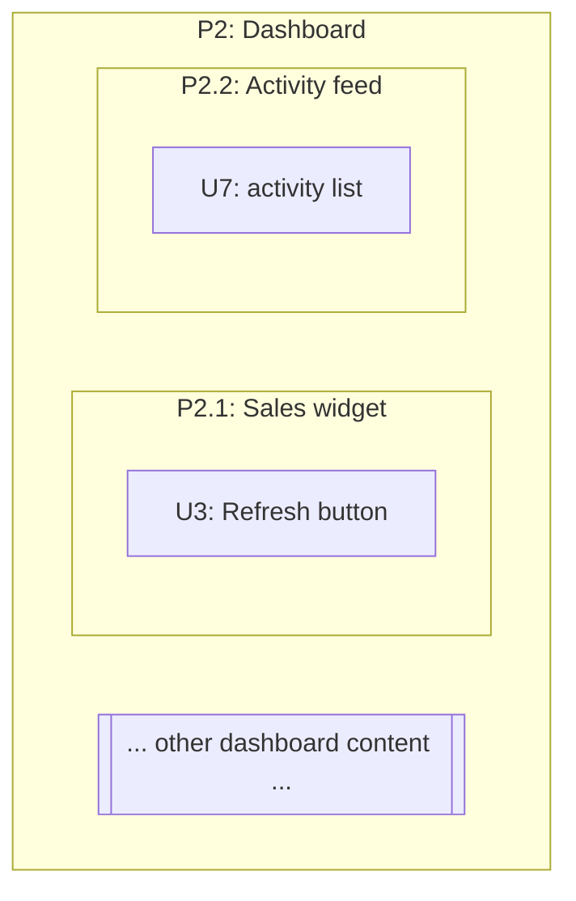

**Placeholder for out-of-scope content:** When detailing one subplace, add a placeholder sibling to show there's more on the page:

```
otherContent[["... other page content ..."]]
```

This tells readers: "we're zooming in on P2.1, but P2 contains more that we're not detailing."

### Containment vs Wiring

These are two different relationships in the data model:

| Relationship | Meaning | Where Captured |
|--------------|---------|----------------|
| **Containment** | Affordance belongs to / lives in a Place | **Place column** (set membership) |
| **Wiring** | Affordance triggers / calls something | **Wires Out column** (control flow) |

**Containment** is set membership: `U1 ∈ P1` means U1 is a member of Place P1. Every affordance belongs to exactly one Place.

**Wiring** is control flow: `U1 → N1` means U1 triggers N1. An affordance can wire to anything — other affordances or Places.

The Place column answers: "Where does this affordance live?"
The Wires Out column answers: "What does this affordance trigger?"

### Navigation Wiring

When an affordance causes navigation (user "goes" somewhere), wire to the **Place itself**, not to an affordance inside:

```
✅ N1 Wires Out: → P2          (navigate to Edit Mode)
❌ N1 Wires Out: → U3          (wiring to affordance inside P2)
```

This makes navigation explicit in the tables. The Place is the destination; specific affordances inside become available once you arrive.

In Mermaid, this becomes:
```
N1 --> P2
```

The subgraph ID matches the Place ID, so the wire connects to the Place boundary.

### Affordances
Things you can act upon:
- **UI affordances (U)**: inputs, buttons, displayed elements, scroll regions
- **Code affordances (N)**: methods, subscriptions, data stores, framework mechanisms

### Wiring
How affordances connect to each other:

**Wires Out** — What an affordance triggers or calls (control flow):
- Call wires: one affordance calls another
- Write wires: code writes to a data store
- Navigation wires: routing to a different place

**Returns To** — Where an affordance's output flows (data flow):
- Return wires: function returns value to its caller
- Read wires: data store is read by another affordance

This separation makes data flow explicit. Wires Out show control flow (what triggers what). Returns To show data flow (where output goes).

---

## The Output: Affordance Tables

The tables are the truth. Every breadboard produces these:

### Places Table

| # | Place | Description |
|---|-------|-------------|
| P1 | Search Page | Main search interface |
| P2 | Detail Page | Individual result view |

### UI Affordances Table

| # | Place | Component | Affordance | Control | Wires Out | Returns To |
|---|-------|-----------|------------|---------|-----------|------------|
| U1 | P1 | search-detail | search input | type | → N1 | — |
| U2 | P1 | search-detail | loading spinner | render | — | — |
| U3 | P1 | search-detail | results list | render | — | — |
| U4 | P1 | search-detail | result row | click | → P2 | — |

### Code Affordances Table

| # | Place | Component | Affordance | Control | Wires Out | Returns To |
|---|-------|-----------|------------|---------|-----------|------------|
| N1 | P1 | search-detail | `activeQuery.next()` | call | → N2 | — |
| N2 | P1 | search-detail | `activeQuery` subscription | observe | → N3 | — |
| N3 | P1 | search-detail | `performSearch()` | call | → N4, → N5, → N6 | — |
| N4 | P1 | search.service | `searchOneCategory()` | call | → N7 | → N3 |
| N5 | P1 | search-detail | `loading` | write | store | → U2 |
| N6 | P1 | search-detail | `results` | write | store | → U3 |
| N7 | P1 | typesense.service | `rawSearch()` | call | — | → N4 |

### Data Stores Table

| # | Place | Store | Description |
|---|-------|-------|-------------|
| S1 | P1 | `results` | Array of search results |
| S2 | P1 | `loading` | Boolean loading state |

### Column Definitions

| Column | Description |
|--------|-------------|
| **#** | Unique ID (P1, P2... for Places; U1, U2... for UI; N1, N2... for Code; S1, S2... for Stores) |
| **Place** | Which Place this affordance belongs to (containment) |
| **Component** | Which component/service owns this |
| **Affordance** | The specific thing you can act upon |
| **Control** | The triggering event: click, type, call, observe, write, render |
| **Wires Out** | What this triggers: `→ N4`, `→ P2` (control flow, including navigation) |
| **Returns To** | Where output flows: `→ N3` or `→ U2, U3` (data flow) |

---

## Procedures

### For Mapping an Existing System

See **Example A** below for a complete worked example.

**Step 1: Identify the flow to analyze**

Pick a specific user journey. Always frame it as an operator trying to do something:
- "Land on /search, type query, scroll for more, click result"
- "Call the payment API with a card token, expect a charge to be created"

**Step 2: List all places involved**

Walk through the journey and identify each distinct place the user visits or system boundary crossed.

**Step 3: Trace through the code to find components**

Starting from the entry point (route, API endpoint), trace through the code to find every component touched by that flow.

**Step 4: For each component, list its affordances**

Read the code. Identify:
- UI: What can the user see and interact with?
- Code: What methods, subscriptions, stores are involved?

**Step 5: Name the actual thing, not an abstraction**

If you write "DATABASE", stop. What's the actual method? (`userRepo.save()`). Every affordance name must be something real you can point to in the code.

**Step 6: Fill in Control column**

For each affordance, what triggers it? (click, type, call, observe, write, render)

**Step 7: Fill in Wires Out**

For each affordance, what does it trigger? Read the code — what does this method call? What does this button's handler invoke?

**Step 8: Fill in Returns To**

For each affordance, where does its output flow?
- Functions that return values → list the callers that receive the return
- Data stores → list the affordances that read from them
- No meaningful output → use `—`

**Step 9: Add data stores as affordances**

When code writes to a property that is later read by another affordance, add that property as a Code affordance with control type `write`.

**Step 10: Add framework mechanisms as affordances**

Include things like `cdr.detectChanges()` that bridge between code and UI rendering. These show how state changes actually reach the UI.

**Step 11: Verify against the code**

Read the code again. Confirm every affordance exists and the wiring matches reality.

---

### For Designing from Shaped Parts

See **Example B** below for a complete worked example including slicing.

**Step 1: List each part from the shape**

Take each mechanism/part identified in shaping and write it down.

**Step 2: Translate parts into affordances**

For each part, identify:
- What UI affordances does this part require?
- What Code affordances implement this part?

**Step 3: Verify every U has a supporting N**

For each UI affordance, check: what Code affordance provides its data or controls its rendering? If none exists, add the missing N.

**Step 4: Classify places as existing or new**

For each UI affordance, determine whether it lives in:
- An existing place being modified
- A new place being created

**Step 5: Wire the affordances**

Fill in Wires Out and Returns To for each affordance. Trace through the intended behavior — what calls what? What returns where?

**Step 6: Connect to existing system (if applicable)**

If there's an existing codebase:
- Identify the existing affordances the new ones must connect to
- Add those existing affordances to your tables
- Wire the new affordances to them

**Step 7: Check for completeness**

- Every U should have an N that feeds it
- Every N should have either Wires Out or Returns To (or both)
- Handlers → should have Wires Out
- Queries → should have Returns To
- Data stores → should have Returns To

**Step 8: Treat user-visible outputs as Us**

Anything the user sees (including emails, notifications) is a UI affordance and needs an N wiring to it.

---

## Key Principles

### Never use memory — always check the data

When tracing a flow backwards, don't follow the path you remember. Scan the Wires Out column for ALL affordances that wire to your target.

When filling in the tables, read each row systematically. Don't rely on what you think you know.

The tables are the source of truth. Your memory is unreliable.

### Every affordance name must exist (when mapping)

When mapping existing code, never invent abstractions. Every name must point to something real in the codebase.

### Mechanisms aren't affordances

An affordance is something you can **act upon** that has meaningful identity in the system. Several things look like affordances but are actually just implementation mechanisms:

| Type | Example | Why it's not an affordance |
|------|---------|---------------------------|
| Visual containers | `modal-frame wrapper` | You can't act on a wrapper — it's just a Place boundary |
| Internal transforms | `letterDataTransform()` | Implementation detail of the caller — not separately actionable |
| Navigation mechanisms | `modalService.open()` | Just the "how" of getting to a Place — wire to the destination directly |

**These aren't always obvious on first draft.** When reviewing your affordance tables, double-check each Code affordance and ask:

> "Is this actually an affordance, or is it just detailing the mechanism for how something happens?"

If it's just the "how" — skip it and wire directly to the destination or outcome.

**Examples:**

```
❌ N8 --> N22 --> P3     (N22 is modalService.open — just mechanism)
✅ N8 --> P3             (handler navigates to modal)

❌ N6 --> N20 --> S2     (N20 is data transform — internal to N6)
✅ N6 --> S2             (callback writes to store)

❌ U7: modal-frame       (wrapper — just the boundary of P3)
✅ U8: Save button       (actionable)
```

The handler navigates to P3. The callback writes to the store. The modal IS P3. The mechanisms are implicit.

### Two flows: Navigation and Data

A breadboard captures two distinct flows:

| Flow | What it tracks | Wiring |
|------|----------------|--------|
| **Navigation** | Movement from Place to Place | Wires Out → Places |
| **Data** | How state populates displays | Returns To → Us |

These are orthogonal. You can have navigation without data changes, and data changes without navigation.

**When reviewing a breadboard, trace both flows:**

1. **Navigation flow:** Can you follow the user's journey from Place to Place?
2. **Data flow:** For every U that displays data, can you trace where that data comes from?

### Every U that displays data needs a source

A UI affordance that displays data must have something feeding it — either a data store (S) or a code affordance (N) that returns data.

```
❌ U6: letter list (no incoming wire — where does the data come from?)
✅ S1 -.-> U6 (store feeds the display)
✅ N4 -.-> U6 (query result feeds the display)
```

If a display U has no data source wiring into it, either:
1. The source is missing from the breadboard
2. The U isn't real

This is easy to miss when focused on navigation. Always ask: "This U shows data — where does that data come from?"

### Every N must connect

If a Code affordance has no Wires Out AND no Returns To, something is wrong:
- Handlers → should have Wires Out (what they call or write)
- Queries → should have Returns To (who receives their return value)
- Data stores → should have Returns To (which affordances read them)

### Side effects need stores

An N that appears to wire nowhere is suspicious. If it has **side effects outside the system boundary** (browser URL, localStorage, external API, analytics), add a **store node** to represent that external state:

```
❌ N41: updateUrl()           (wires to... nothing?)
✅ N41: updateUrl() → S15     (wires to Browser URL store)
```

This makes the data flow explicit. The store can also have return wires showing how external state flows back in:

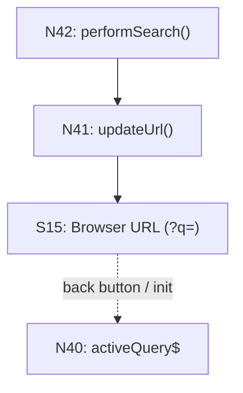

Common external stores to model:
- `Browser URL` — query params, hash fragments
- `localStorage` / `sessionStorage` — persisted client state
- `Clipboard` — copy/paste operations
- `Browser History` — navigation state

### Separate control flow from data flow

Wires Out = control flow (what triggers what)
Returns To = data flow (where output goes)

This separation makes the system's behavior explicit.

### Show navigation inline, not as loops

Routing is a generic mechanism every page uses. Instead of drawing all navigation through a central Router affordance, show `Router navigate()` inline where it happens and wire directly to the destination place.

### Place stores where they enable behavior, not where they're written

A data store belongs in the Place where its data is *consumed* to enable some effect — not where it's produced. Writes from other Places are "reaching into" that Place's state.

To determine where a store belongs:
1. **Trace read/write relationships** — Who writes? Who reads?
2. **The readers determine placement** — that's where behavior is enabled
3. **If only one Place reads**, the store goes inside that Place

Example: A `changedPosts` array is written by a Modal (when user confirms changes) but read by a PAGE_SAVE handler (when user clicks Save). The store belongs with the PAGE_SAVE handler — that's where it enables the persistence operation.

### Only extract to shared areas when truly shared

Before putting a store in a separate DATA STORES section, verify it's actually read by multiple Places. If it only enables behavior in one Place, it belongs inside that Place.

### Nest stores in the subcomponent that reads them

Within a Place, put stores in the subcomponent where they enable behavior. If a store is read by a specific handler, put it in that handler's component — not floating at the Place level.

### Backend is a Place

The database and resolvers aren't floating infrastructure — they're a Place with their own affordances. Database tables (S) belong inside the Backend Place alongside the resolvers (N) that read and write them.

---

## Catalog of Parts and Relationships

This section provides a complete reference of everything that can appear in a breadboard.

### Elements

| Element | ID Pattern | What It Is | What Qualifies |
|---------|------------|------------|----------------|
| **Place** | P1, P2, P3... | A bounded context of interaction | Blocking test: can't interact with what's behind |
| **Subplace** | P2.1, P2.2... | A defined subset within a Place | Groups related affordances within a larger Place |
| **Place Reference** | _PlaceName | UI affordance pointing to a detached place | Complex nested place defined separately |
| **UI Affordance** | U1, U2, U3... | Something the user can see or interact with | Inputs, buttons, displays, scroll regions |
| **Code Affordance** | N1, N2, N3... | Something in code you can act upon | Methods, subscriptions, handlers, framework mechanisms |
| **Data Store** | S1, S2, S3... | State that persists and is read/written | Properties, arrays, observables that hold data |
| **Chunk** | — | A collapsed subsystem | One wire in, one wire out, many internals |
| **Placeholder** | — | Out-of-scope content marker | Shows context without detailing |

### Relationships

| Relationship | Syntax | Meaning | Example |
|--------------|--------|---------|---------|
| **Containment** | Place column | Affordance belongs to Place | `U3` in Place `P2.1` |
| **Wires Out** | `→ X` | Control flow: triggers/calls | `→ N4`, `→ P2` |
| **Returns To** | `→ X` (in Returns To column) | Data flow: output goes to | `→ U6`, `→ N3` |
| **Abbreviated flow** | `\|label\|` | Intermediate steps omitted | `S4 -.-> \|view query\| U6` |
| **Parent-child** | Hierarchical ID | Subplace belongs to Place | P2.1 is child of P2 |

### Containment vs Wiring

| Relationship | Meaning | Where Captured |
|--------------|---------|----------------|
| **Containment** | Affordance belongs to / lives in a Place | Place column (set membership) |
| **Wiring** | Affordance triggers / calls something | Wires Out column (control flow) |

Containment is set membership: `U1 ∈ P1` means U1 is a member of Place P1.
Wiring is control flow: `U1 → N1` means U1 triggers N1.

### What Qualifies as Each Element

**Place (P):**
- Passes the blocking test — can't interact with what's behind
- Examples: modal, edit mode (whole screen transforms), route/page
- Not: dropdown, tooltip, checkbox revealing fields

**Place Reference (_PlaceName):**
- A UI affordance that represents a detached place
- Use when a nested place has many affordances and would clutter the parent
- Examples: `_letter-browser`, `_user-profile-widget`
- Wires to the full place definition: `_letter-browser --> P3`

**UI Affordance (U):**
- User can see it or interact with it
- Examples: button, input, list, spinner, displayed text
- Not: wrapper elements, layout containers

**Code Affordance (N):**
- Has meaningful identity — you can point to it in code
- Examples: `handleSubmit()`, `query$ subscription`, `detectChanges()`
- Not: internal transforms, navigation mechanisms (see below)

**Data Store (S):**
- State that is written and read
- Examples: `results` array, `loading` boolean, `changedPosts` list
- External stores: `Browser URL`, `localStorage`, `Clipboard` — represent state outside the app boundary
- Not: config that's set once and never changes (consider as config affordance)

### Verification Checks

| Check | Question | If No... |
|-------|----------|----------|
| **Every U that displays data** | Does it have an incoming wire (via Wires Out or Returns To)? | Add the data source |
| **Every N** | Does it have Wires Out or Returns To (or both)? | Investigate — may be dead code or missing wiring |
| **Every S** | Does something read from it (Returns To)? | Investigate — may be unused |
| **Navigation mechanisms** | Is this N just the "how" of getting somewhere? | Wire directly to Place instead |
| **N with side effects** | Does this N affect external state (URL, storage, clipboard)? | Add a store for the external state |

---

## Chunking

Chunking collapses a subsystem into a single node in the main diagram, with details shown separately. Use chunking to manage complexity when a section of the breadboard has:

- **One wire in** (single entry point)
- **One wire out** (single output)
- **Lots of internals** between them

### When to Chunk

Look for sections where tracing the wiring reveals a "pinch point" — many affordances that funnel through a single input and single output. These are natural boundaries for chunking.

Example: A `dynamic-form` component receives a form definition, renders many fields (U7a-U7k), validates on change (N26), and emits a single `valid$` signal. In the main diagram, this becomes:

```
N24 -->|formDefinition| dynamicForm
dynamicForm -.->|valid$| U8
```

### How to Chunk

1. **In the main diagram**, replace the subsystem with a single stadium-shaped node:

```
dynamicForm[["CHUNK: dynamic-form"]]
```

2. **Wire to/from the chunk** using the boundary signals:

```
N24 -->|formDefinition| dynamicForm
dynamicForm -.->|valid$| U8
```

3. **Create a separate chunk diagram** showing the internals with boundary markers:

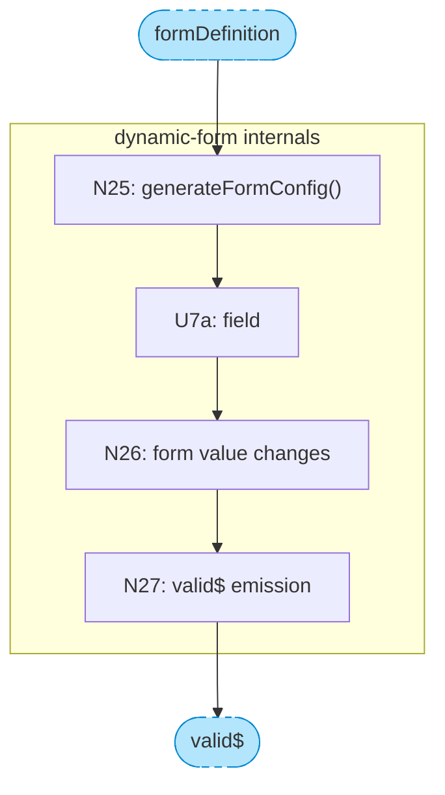

4. **Style chunks distinctly** in the main diagram:

```
classDef chunk fill:#b3e5fc,stroke:#0288d1,color:#000,stroke-width:2px
class dynamicForm chunk
```

### Chunk Color Convention

| Type | Color | Hex |
|------|-------|-----|
| Chunk node (main diagram) | Light blue | `#b3e5fc` |
| Boundary markers (chunk diagram) | Light blue, dashed | `#b3e5fc` with `stroke-dasharray:5 5` |

### Benefits

- **Main diagram stays readable** — complex subsystems become single nodes
- **Detail preserved** — chunk diagrams show the internals when needed
- **Natural boundaries** — chunks often map to reusable components

---

## Visualization (Mermaid)

The tables are the truth. Mermaid diagrams are optional visualizations for humans.

### Basic Structure

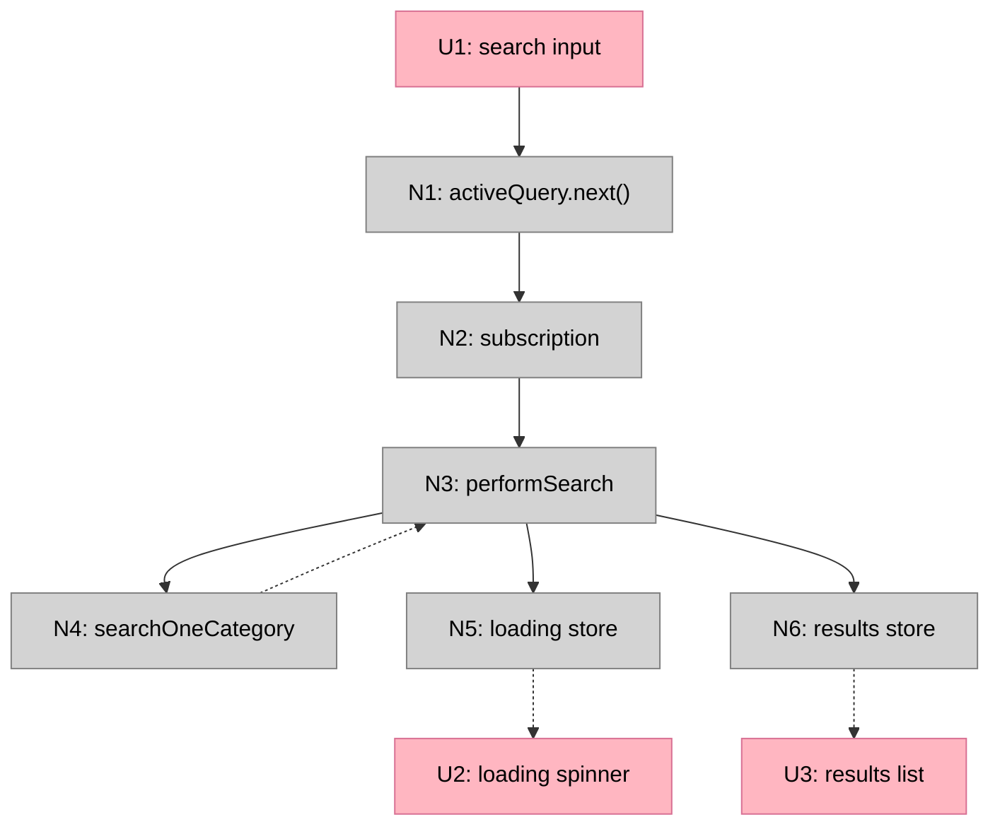

### Line Conventions

| Line Style | Mermaid Syntax | Use |
|------------|----------------|-----|
| Solid (`-->`) | `A --> B` | Wires Out: calls, triggers, writes |
| Dashed (`-.->`) | `A -.-> B` | Returns To: return values, data store reads |
| Labeled `...` | `A -.->|...| B` | Abbreviated flow: intermediate steps omitted |

#### Abbreviating Out-of-Scope Flows

When a data flow has intermediate steps that aren't relevant to the breadboard's scope, abbreviate by wiring directly from source to destination with a `...` label:

```
S4 -.->|...| U6
```

This says "data flows from S4 to U6, with intermediate steps omitted." Use this when:
- The flow exists but its internals are out of scope
- You need to show where data originates without detailing the query chain
- The breadboard focuses on one workflow (e.g., editing) but needs to acknowledge another (e.g., viewing)

### ID Prefixes

| Prefix | Type | Example |
|--------|------|---------|
| **P** | Places | P1, P2, P3 |
| **U** | UI affordances | U1, U2, U3 |
| **N** | Code affordances | N1, N2, N3 |
| **S** | Data stores | S1, S2, S3 |

### Color Conventions

| Type | Color | Hex |
|------|-------|-----|
| Places (subgraphs) | White/transparent | — |
| UI affordances | Pink | `#ffb6c1` |
| Code affordances | Grey | `#d3d3d3` |
| Data stores | Lavender | `#e6e6fa` |
| Chunks | Light blue | `#b3e5fc` |
| Place references | Pink, dashed border | `#ffb6c1` |

```
classDef ui fill:#ffb6c1,stroke:#d87093,color:#000
classDef nonui fill:#d3d3d3,stroke:#808080,color:#000
classDef store fill:#e6e6fa,stroke:#9370db,color:#000
classDef chunk fill:#b3e5fc,stroke:#0288d1,color:#000,stroke-width:2px
classDef placeRef fill:#ffb6c1,stroke:#d87093,stroke-width:2px,stroke-dasharray:5 5
```

### Subgraph Labels and Place IDs

Use the Place ID as the subgraph ID so navigation wiring connects properly:

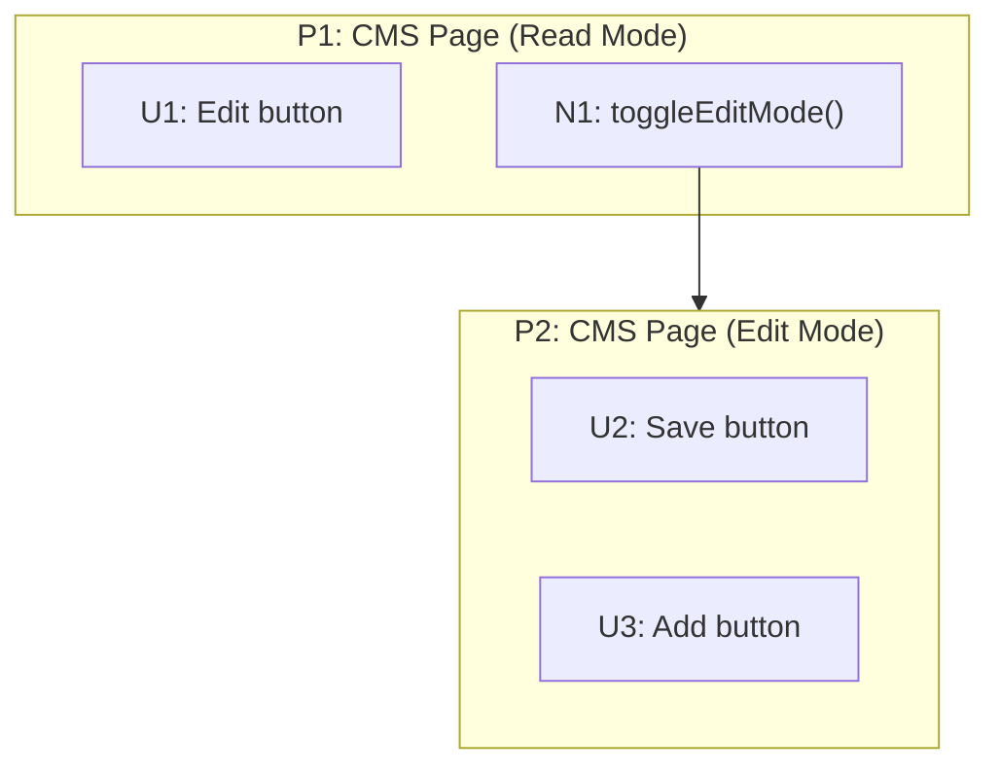

| Type | ID Pattern | Label Pattern | Purpose |
|------|------------|---------------|---------|
| Place | `P1`, `P2`... | `P1: Page Name` | A bounded context the user visits |
| Trigger | — | `TRIGGER: Name` | An event that kicks off a flow (not navigable) |
| Component | — | `COMPONENT: Name` | Reusable UI+logic that appears in multiple places |
| System | — | `SYSTEM: Name` | When spanning multiple applications |

**Key point:** The subgraph ID (`P1`, `P2`) must match the Place ID from the Places table. This allows navigation wires like `N1 --> P2` to connect to the Place boundary.

### When spanning multiple systems

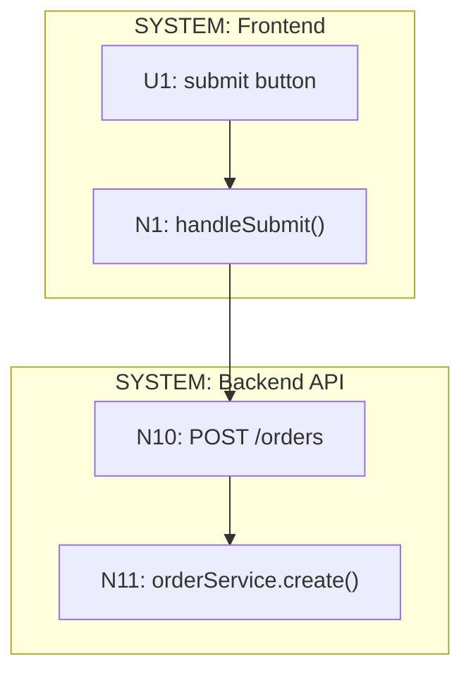

### Workflow Step Annotations (Optional)

When breadboarding a specific workflow, you can optionally add numbered step markers to help readers follow the sequence visually. This is useful when:
- The diagram is complex and the workflow path isn't obvious
- You want to guide someone through a specific user journey
- The breadboard will be used as a walkthrough or teaching tool

**Format:**

Add a Workflow Guide table before the diagram:

```markdown
| Step | Action | Where to look |
|------|--------|---------------|
| **1** | Click "Edit" button | U1 → N1 → S1 |
| **2** | Edit mode activates | S1 → N2 → U3 |
| **3** | Click "Add" | U3 → N3 → N8 |
```

Add step marker nodes in the Mermaid diagram using stadium-shaped nodes:

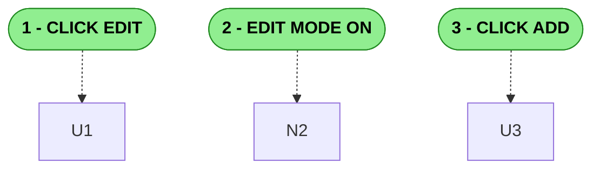

**Formatting notes:**
- Use `"1 - ACTION"` format (number, space, hyphen, space, action)
- Avoid `"1. ACTION"` — the period triggers Mermaid's markdown list parser
- Avoid `"1) ACTION"` — parentheses can also cause parsing issues
- Connect step markers to affordances with dashed lines (`-.->`)
- Style steps green to distinguish from UI (pink) and Code (grey) affordances

---

## Slicing a Breadboard

Slicing takes a breadboard and groups its affordances into **vertical implementation slices**. See **Example B** below for a complete slicing example.

**Input:**
- Breadboard (affordance tables with wiring)
- Shape (R + mechanisms) — guides what demos matter

**Output:**
- Breadboard with affordances assigned to slices V1–V9 (max 9 slices)

### What is a Vertical Slice?

A vertical slice is a group of UI and Code affordances that does something demo-able. It cuts through all layers (UI, logic, data) to deliver a working increment.

The opposite is a horizontal slice — doing work on one layer (e.g., "set up all the data models") that isn't clickable from the interface.

### The Key Constraint

**Every slice must have visible UI that can be demoed.** A slice without UI is a horizontal layer, not a vertical slice.

- ✅ "Self-serve Signing Path" (demo: checkout → sign → see signature)
- ❌ "Database Schema" (no demo possible)

**Demo-able means:**
- Has an entry point (UI interaction or trigger)
- Has an observable output (UI renders, effect occurs)
- Shows meaningful progress toward the R

The shape guides what counts as "meaningful progress" — you're not just grouping affordances arbitrarily, you're grouping them to demonstrate mechanisms working.

### Slice Size

- **Too small:** Only 1-2 UI affordances, no meaningful demo → merge with related slice
- **Too big:** 15+ affordances or multiple unrelated journeys → split
- **Right size:** A coherent journey with a clear "watch me do this" demo

Aim for ≤9 slices. If you need more, the shape may be too large for one cycle.

### Wires to Future Slices

A slice may contain affordances with Wires Out pointing to affordances in later slices. These wires exist in the breadboard but aren't implemented yet — they're stubs or no-ops until that later slice is built.

This is normal. The breadboard shows the complete system; slicing shows the order of implementation.

### Procedure

**Step 1: Identify the minimal demo-able increment**

Look at your breadboard and shape. Ask: "What's the smallest subset that demonstrates the core mechanism working?"

Usually this is:
- The core data fetch
- Basic rendering
- No search, no pagination, no state persistence yet

This becomes V1.

**Step 2: Layer additional capabilities as slices**

Look at the mechanisms in your shape. Each slice should demonstrate a mechanism working:
- V2: Search input (demonstrates the search mechanism)
- V3: Pagination/infinite scroll (demonstrates the pagination mechanism)
- V4: URL state persistence (demonstrates the state preservation mechanism)
- etc.

**Max 9 slices.** If you have more, combine related mechanisms. Features that don't make sense alone should be in the same slice.

**Step 3: Assign affordances to slices**

Go through every affordance and assign it to the slice where it's first needed to demo that slice's mechanism:

| Slice | Mechanism | Affordances |
|-------|-----------|-------------|
| V1 | Core display | U2, U3, N3, N4, N5, N6, N7 |
| V2 | Search | U1, N1, N2 |
| V3 | Pagination | U10, N11, N12, N13 |

Some affordances may have Wires Out to later slices — that's fine. They're implemented in their assigned slice; the wires just don't do anything yet.

**Step 4: Create per-slice affordance tables**

For each slice, extract just the affordances being added:

**V2: Search Works**

| # | Component | Affordance | Control | Wires Out | Returns To |
|---|-----------|------------|---------|-----------|------------|
| U1 | search-detail | search input | type | → N1 | — |
| N1 | search-detail | `activeQuery.next()` | call | → N2 | — |
| N2 | search-detail | `activeQuery` subscription | observe | → N3 | — |

**Step 5: Write a demo statement for each slice**

Each slice needs a concrete demo that shows its mechanism working toward the R:
- V1: "Widget shows real data from the API"
- V2: "Type 'dharma', results filter live"
- V3: "Scroll down, more items load"

The demo should be something you can show a stakeholder that demonstrates progress.

### Visualizing Slices in Mermaid

Show the complete breadboard in every slice diagram, but use styling to distinguish scope:

| Category | Style | Description |
|----------|-------|-------------|
| **This slice** | Bright color | Affordances being added |
| **Already built** | Solid grey | Previous slices |
| **Future** | Transparent, dashed border | Not yet built |

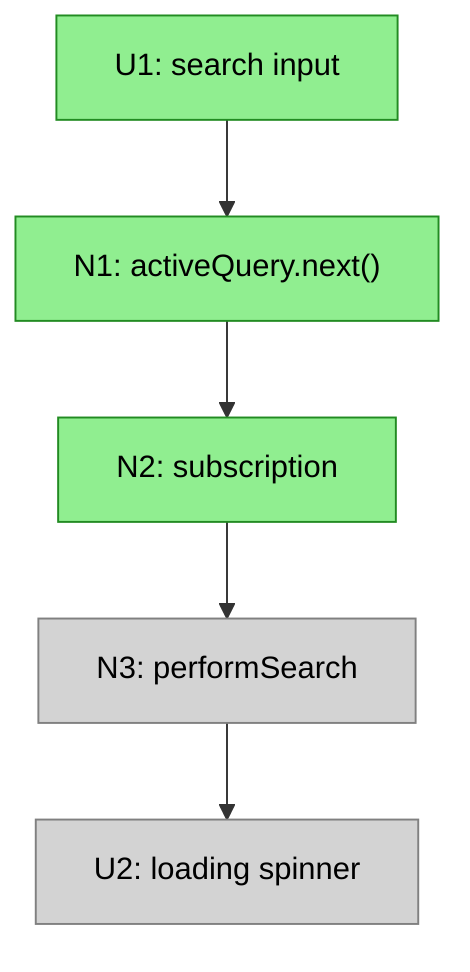

This lets stakeholders see:
- What's being built now (highlighted)
- What already exists (grey)
- What's coming later (faded)

### Slice Summary Format

| # | Slice | Mechanism | Demo |
|---|-------|-----------|------|
| V1 | Widget with real data | F1, F4, F6 | "Widget shows letters from API" |
| V2 | Search works | F3 | "Type to filter results" |
| V3 | Infinite scroll | F5 | "Scroll down, more load" |
| V4 | URL state | F2 | "Refresh preserves search" |

The Mechanism column references parts from the shape, showing which mechanisms each slice demonstrates.

---
---

# Examples

## Example A: Mapping an Existing System

This example shows breadboarding an existing system to understand how data flows through multiple entry points.

### Input

Workflow to understand: "How is `admin_organisation_countries` modified and read downstream? There are multiple entry points: manual edit, checkbox toggle, and batch job."

### Output

**UI Affordances**

| # | Component | Affordance | Control | Wires Out | Returns To |
|---|-----------|------------|---------|-----------|------------|
| U1 | SSO Admin | `role_profiles` checkboxes | render | — | — |
| U2 | SSO Admin | "Country Admin" checkbox | click | toggles selection | — |
| U3 | SSO Admin | `admin_countries` filter_horizontal | render | — | — |
| U4 | SSO Admin | Available countries list | render | — | — |
| U5 | SSO Admin | Selected countries list | render | — | — |
| U6 | SSO Admin | Add → / Remove ← | click | modifies selection | — |
| U7 | SSO Admin | Save button | click | → N3 | — |
| U20 | DWConnect | "Country admins" section | render | — | — |
| U21 | (unknown) | System email "From" field | render | — | — |

**Code Affordances**

| # | Component | Affordance | Control | Wires Out | Returns To |
|---|-----------|------------|---------|-----------|------------|
| N1 | sso/accounts/admin | `get_fieldsets()` | call | → U3 (conditional) | — |
| N2 | sso/accounts/models | `get_administrable_user_countries()` | call | — | → U4 |
| N3 | sso/accounts/admin | `save_form()` | call | → N4, → N5 | — |
| N4 | Django Admin | Form M2M save | call | → S2 | — |
| N5 | sso/forms/mixins | `_update_user_m2m()` | call | → S1, → N6 | — |
| N6 | sso/signals | `user_m2m_field_updated` signal | signal | → N10 | — |
| N7 | CLI/Scheduler | `manage.py dwbn_cleanup` | invoke | → N15 | — |
| N10 | sso-dwbn-theme | `dwbn_user_m2m_field_updated()` | receive | → N11 | — |
| N11 | sso-dwbn-theme | `dwbn_user_m2m_field_updated_task()` | call | → N12 | — |
| N12 | sso-dwbn-theme | Country Admin added AND zero admin countries? | conditional | → N20 | — |
| N15 | sso-dwbn-theme | `admin_changes()` | call | → N16 | — |
| N16 | sso-dwbn-theme | For each Country Admin: home center country missing? | loop | → N20 | — |
| N20 | sso-dwbn-theme | Get home center's country | call | → N21 | — |
| N21 | sso-dwbn-theme | `admin_organisation_countries.add()` | call | → S2 | — |
| N22 | sso-dwbn-theme | `update_last_modified()` | call | — | — |
| N30 | dwconnect2-backend | `findCenterAdmins()` | call | — | → U20 |
| N31 | sso/api | `get_object_data()` | call | — | → external |

**Data Stores**

| # | Store | Description |
|---|-------|-------------|
| S1 | `role_profiles` | M2M: which role profiles a user has |
| S2 | `admin_organisation_countries` | M2M: which countries a user administers |
| S3 | `organisations` | User's home center(s) |

**Mermaid Diagram**

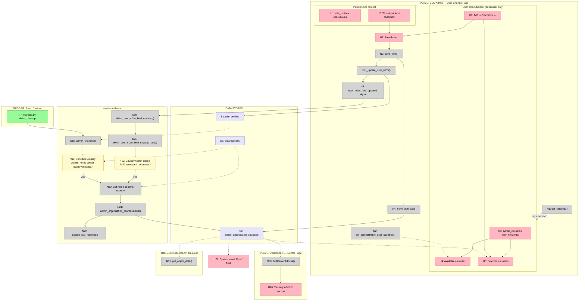

---

## Example B: Designing from Shaped Parts

---

### Part 1: Shaping Context (Input to Breadboarding)

This section shows what comes FROM shaping — the requirements, existing patterns identified, and sketched parts. This is the INPUT that breadboarding receives.

> **Note:** This example uses shaping terminology. In shaping, you define requirements (Rs), identify existing patterns to reuse, and sketch a solution as parts/mechanisms. Breadboarding takes this shaped solution and details out the concrete affordances and wiring.

**The R (Requirements)**

| ID | Requirement |
|----|-------------|
| R0 | Make content searchable from the index page |
| R2 | Navigate back to pagination state when returning from detail |
| R3 | Navigate back to search state when returning from detail |
| R4 | Search/pagination state survives page refresh |
| R5 | Browser back button restores previous search/pagination state |
| R9 | Search should debounce input (not fire on every keystroke) |
| R10 | Search should require minimum 3 characters |
| R11 | Loading and empty states should provide user feedback |

**Existing System with Reusable Patterns (S-CUR)**

The app already has a global search page that implements most of these Rs. During shaping, it was documented at the parts/mechanism level:

| Part | Mechanism |
|------|-----------|
| **S-CUR1** | **URL state & initialization** |
| S-CUR1.1 | Router queryParams observable provides `{q, category}` |
| S-CUR1.2 | `initializeState(params)` sets query and category from URL |
| S-CUR1.3 | On page load, triggers initial search from URL state |
| **S-CUR2** | **Search input** |
| S-CUR2.1 | Search input binds to `activeQuery` BehaviorSubject |
| S-CUR2.2 | `activeQuery` subscription with 90ms debounce |
| S-CUR2.3 | Min 3 chars triggers `performNewSearch()` |
| **S-CUR3** | **Data fetching** |
| S-CUR3.1 | `performNewSearch()` sets loading state, calls search service |
| S-CUR3.2 | Search service builds Typesense filter, calls `rawSearch()` |
| S-CUR3.3 | `rawSearch()` queries Typesense, returns `{found, hits}` |
| S-CUR3.4 | Results written to `detailResult` data store |
| **S-CUR4** | **Pagination** |
| S-CUR4.1 | Scroll-to-bottom triggers `appendNextPage()` via intercomService |
| S-CUR4.2 | `appendNextPage()` increments page, calls search |
| S-CUR4.3 | New hits concatenated to existing hits |
| S-CUR4.4 | `sendMessage()` re-arms scroll detection |
| **S-CUR5** | **Rendering** |
| S-CUR5.1 | `cdr.detectChanges()` triggers template re-evaluation |
| S-CUR5.2 | Loading spinner, "no results", result count based on store |
| S-CUR5.3 | `*ngFor` renders tiles for each hit |
| S-CUR5.4 | Tile click navigates to detail page |

**Sketched Solution: Parts that Adapt S-CUR**

The new solution's parts explicitly reference which S-CUR patterns they adapt:

| Part | Mechanism | Adapts |
|------|-----------|--------|
| F1 | Create widget (component, def, register) | — |
| F2 | URL state & initialization (read `?q=`, restore on load) | S-CUR1 |
| F3 | Search input (debounce, min 3 chars, triggers search) | S-CUR2 |
| F4 | Data fetching (`rawSearch()` with filter) | S-CUR3 |
| F5 | Pagination (scroll-to-bottom, append pages, re-arm) | S-CUR4 |
| F6 | Rendering (loading, empty, results list, rows) | S-CUR5 |

---

### Part 2: Breadboarding (Transform Parts → Affordances)

This is where breadboarding happens. The shaped parts become concrete affordances with explicit wiring. The output is the affordance tables and diagram.

**UI Affordances**

| # | Component | Affordance | Control | Wires Out | Returns To |
|---|-----------|------------|---------|-----------|------------|
| U1 | letter-browser | search input | type | → N1 | — |
| U2 | letter-browser | loading spinner | render | — | — |
| U3 | letter-browser | no results msg | render | — | — |
| U4 | letter-browser | result count | render | — | — |
| U5 | letter-browser | results list | render | → U6, U7, U8, U9 | — |
| U6 | letter-row | row click | click | → LD | — |
| U7 | letter-row | date | render | — | — |
| U8 | letter-row | subject | render | — | — |
| U9 | letter-row | teaser | render | — | — |
| U10 | letter-browser | scroll | scroll | → N11 | — |
| U11 | browser | back button | click | → N9 | — |
| U12 | letter-browser | "See all X results" | click | → LP | — |
| LD | — | Letter Detail | place | — | — |
| LP | — | Full Page | place | — | — |

**Code Affordances**

| # | Component | Affordance | Control | Wires Out | Returns To |
|---|-----------|------------|---------|-----------|------------|
| N1 | letter-browser | `activeQuery.next()` | call | → N2 | → U12 |
| N2 | letter-browser | `activeQuery` subscription | observe | → N3 | — |
| N3 | letter-browser | `performSearch()` | call | → N4, → N6, → N7, → N8 | — |
| N4 | typesense.service | `rawSearch()` | call | — | → N3, → N12 |
| N5 | letter-browser | `parentId` (config) | config | — | → N4 |
| N6 | letter-browser | `loading` store | write | — | → N8 |
| N7 | letter-browser | `detailResult` store | write | — | → N8, → N16 |
| N8 | letter-browser | `detectChanges()` | call | → U2, → U3, → U4, → U5 | — |
| N9 | browser | URL `?q=` | read | → N10 | — |
| N10 | letter-browser | `initializeState()` | call | → N1, → N3 | — |
| N11 | intercom.service | scroll subject | observe | → N12 | — |
| N12 | letter-browser | `appendNextPage()` | call | → N4, → N7, → N8, → N13, → N14 | — |
| N13 | intercom.service | `sendMessage()` | call | → N11 | — |
| N14 | router | `navigate()` | call | — | → N9 |
| N15 | letter-browser | if `!compact` subscribe | conditional | → N11 | — |
| N16 | letter-browser | if truncated show link | conditional | → U12 | — |
| N17 | letter-browser | `compact` (config) | config | — | → N4, → N15, → N16 |
| N18 | letter-browser | `fullPageRoute` (config) | config | — | → U12 |

**Mermaid Diagram**

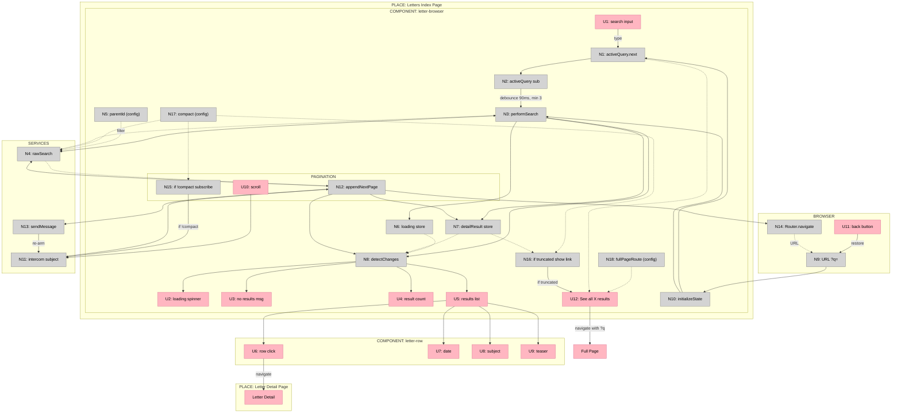

**Slicing the Breadboard**

With the full breadboard complete, slice it into vertical increments. Each slice demonstrates a mechanism working:

**Slice Summary**

| # | Slice | Mechanism | Affordances | Demo |
|---|-------|-----------|-------------|------|
| V1 | Widget with real data | F1, F4, F6 | U2-U9, N3-N8, LD | "Widget shows real data" |
| V2 | Search works | F3 | U1, N1, N2 | "Type 'dharma', results filter" |
| V3 | Infinite scroll | F5 | U10, N11-N13 | "Scroll down, more load" |
| V4 | URL state | F2 | U11, N9, N10, N14 | "Refresh preserves search" |
| V5 | Compact mode | — | U12, N15-N18, LP | "Shows 'See all' link" |

**Slice Diagram**

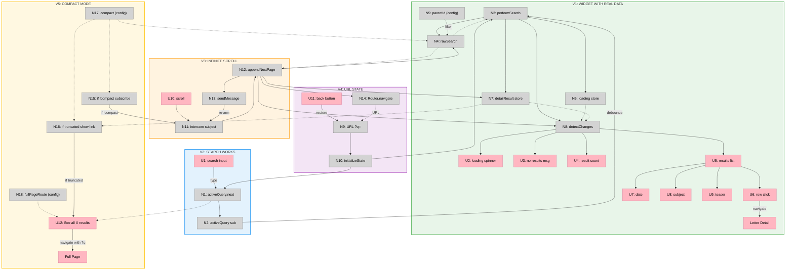

```

### `breadboard-reflection/skill.md`

```markdown
# Breadboard Analysis

Reflect on a breadboard by syncing it to the implementation, then finding and fixing design smells. Works on existing breadboards built with the `/breadboarding` skill.

---

## What a Breadboard Is

A breadboard should be a legible explanation of how the system produces its effects. When you look at it, you should be able to account for every behavior — not just see that an effect happens, but understand *how* it happens through the wiring.

When someone's mental model of how the system behaves doesn't match what the breadboard shows, either their model is wrong or the breadboard is incomplete. A smell is that gap — you expect to see work being done (data transformed, decisions made, state managed) and the breadboard doesn't show it. Each question that probes the gap ("what generates this data?", "where is this defined?", "who calls this?") is testing the mental model against the artifact.

The breadboard is complete when it can explain every behavior without hidden steps.

---

## Core Checklist

Reflection is a two-phase loop: **SEE, then REFLECT.** Always in this order.

### Phase 1: SEE — Sync breadboard to the implementation

The code is ground truth. The breadboard may have drifted or been built from a conceptual shape that doesn't match what was actually implemented. Before looking for design problems, make the breadboard accurate.

1. **Read the implementation code.** Find the relevant source files. Don't rely on the breadboard's current description of what the code does.
2. **Inspect the seams.** Walk the code using the checklist in "Reading Seams from the Implementation" below — module boundaries, module-level definitions, function signatures, full call chains, decorators, state co-access.
3. **Update the breadboard to match.** Add missing nodes, stores, and places. Fix wrong wiring. Remove stale affordances. The goal is: the breadboard now accurately reflects the code's actual structure — even if that structure has problems.

After Phase 1, the breadboard shows what IS, not what should be.

### Phase 2: REFLECT — Find and fix design smells

Phase 1 is preparation. Phase 2 is the point. Do not skip it.

Now that the breadboard is accurate, inspect it for design problems. The code's names might be wrong. The split of responsibilities might not be ideal. The wiring might reveal unnecessary coupling or missing abstractions. Walk through each of these concrete checks:

1. **Trace user stories through the wiring.** Does the path tell a coherent story? Can you explain every behavior without hidden steps?
2. **Run the naming test on every affordance.** For each node: who is the caller, what is the step-level effect, can you name it with one idiomatic verb? Flag any that resist naming. (See "The Naming Test" in Phase 2 details below.)
3. **Check for hidden data stores.** For every module-level constant, config object, or template that an affordance reads: is it in the Data Stores table? If code reads it to produce effects, it's a store — even if it's static. Ask: "what does this affordance need to know in order to do its job?" If the answer references something not in the breadboard, it's missing.
4. **Question the places.** For each place: does everything in it share a single responsibility? Do state and affordances within it co-access each other and stay isolated from other places? If a cluster of affordances, state, and UI elements all serve one job (e.g., "turn natural language into structured commands"), they might deserve their own place — even if the code doesn't separate them yet.
5. **Check the smells table.** Unexplained behavior, incoherent wiring, naming resistance, etc.
6. **Fix smells.** Split, merge, rename, or rewire affordances. Update the breadboard.
7. **Optionally update the code.** If the breadboard reveals a better design, refactor the implementation to match.

The loop: SEE what the code actually does → REFLECT on whether that design is right → fix the breadboard → optionally fix the code → repeat.

---

## Phase 1: SEE — Read Seams from the Implementation

The code is ground truth. Read it before judging the breadboard.

### What to Look For

**1. Module boundaries are seams.** Each file or module is a boundary the code has already chosen. Check what crosses it — that's a public interface, and the breadboard should show it. If a module exists (e.g., `llm.py` separate from `app.py`), the breadboard shouldn't reach through it to grab internals. The module's public function is the affordance; what it calls internally is behind the boundary.

**2. Module-level definitions are data stores.** Constants, configurations, and templates at the top of a module — `TOOLS`, `SYSTEM_PROMPT`, `DEFAULTS` — are static state that shapes behavior. If code reads them to produce effects, they belong in the breadboard as stores. They're easy to miss because they don't change at runtime, but they define what the system can do.

**3. Function signatures are contracts.** The types tell you what data flows across boundaries. When a function's return type differs from what its downstream dependency returns (e.g., `send_command` returns `list[dict]` but `ollama.chat` returns a Response object), there's a transformation happening. That transformation is work the breadboard should account for. Name it.

**4. Trace the full call chain, not just endpoints.** Don't jump from the UI event to the external service to the executor. Walk every function in the chain. Each one exists for a reason — orchestration, state management, data transformation, error handling. The ones that do real work (not just forwarding) are affordances. Skipping intermediate functions because they look like "glue" hides the explanation.

**5. Decorators and patterns signal architectural roles.** `@work(thread=True)` means background worker. `try/except` wrappers mean error boundary. `async` means concurrency management. These aren't just implementation details — they tell you a function has a specific role in the system's architecture. An event handler that delegates to a `@work` function is two distinct things: a trigger and an orchestrator.

**6. State that co-accesses suggests places.** Which functions and state are used together but don't touch other parts of the system? If `loading`, `TOOLS`, and `SYSTEM_PROMPT` are all accessed by the command input flow and never by the table display, they cluster into a candidate place. Places emerge from co-access patterns, not just from UI layout.

### The Underlying Principle

A breadboard designed from a conceptual shape ("user types, LLM processes, app executes") will be a flat pipeline. The code is more specific — it has already decided where the seams are through module splits, function extractions, and static configuration. When a breadboard exists alongside code, read the code's seams and check that the breadboard accounts for them. Not every function needs a node, but every module boundary, every data transformation, and every piece of static configuration that shapes behavior should show up somewhere.

### Updating the Breadboard

After inspecting the code, update the breadboard to match what IS:
- Add missing nodes for functions the breadboard skipped
- Add missing stores for constants and configuration the breadboard ignored
- Fix wiring to match actual call chains
- Add or restructure places based on state co-access

Do NOT fix design problems yet. The goal of Phase 1 is an accurate picture, even if the design has issues.

---

## Phase 2: REFLECT — Find and Fix Design Smells

Now the breadboard is accurate. The code's names might be wrong, the split of responsibilities might not be ideal, the wiring might reveal unnecessary coupling. This is where you judge the design.

### Trace User Stories Through the Wiring

Take a user story from the requirements or frame. Trace it through the breadboard wiring. Ask: does the path tell a coherent story that produces the expected effect?

Example: "User says 'add Tokyo after Detroit' → Tokyo appears after Detroit in the table, and persists across restarts."

Trace: U4 (input) → N1 → N2 (LLM) → N3 (dispatch) → N4 (handle) → ... → S1 (locales updated) → N12 (persist) → S4 (config written).

At each link, ask: does this step logically lead to the next? Does the wiring make sense as a story about how the effect happens?

### What Smells Look Like

| Smell | What you notice |
|-------|-----------------|
| **Unexplained behavior** | You know the system does something (transforms data, makes decisions) but the breadboard doesn't show how — the explanation is missing |
| **Incoherent wiring** | A node writes to S1 AND triggers the thing that writes to S1 — redundant or contradictory |
| **Missing path** | The user story requires an effect, but no wiring path produces it |
| **Diagram-only nodes** | Nodes in the diagram that aren't in the affordance tables — decoration, not real affordances |
| **Naming resistance** | You can't name an affordance with one idiomatic verb (see Naming Test below) |
| **Stale affordances** | The breadboard shows something that no longer exists in the code — should have been caught in Phase 1 |
| **Wrong causality** | The wiring shows A calls B, but the code shows C calls B — should have been caught in Phase 1 |

The first five are design smells — the code works but the design could be better. The last two are accuracy problems that Phase 1 should have caught; if you find them here, go back to Phase 1.

### Fixing Smells

#### The Naming Test

The primary tool for finding and fixing affordance boundary problems.

For each affordance:

1. **Who is the caller?** Identify the user of this affordance.
2. **What is the step-level effect?** What does THIS affordance do — not the downstream chain, just its own direct effect?
3. **Name it with one verb.** Describe the step-level effect with a single, idiomatic English verb.

| Signal | Meaning |
|--------|---------|
| One verb covers all code paths | Boundary is correct |
| Need "or" to connect two verbs | Likely two affordances bundled together |
| Name doesn't feel idiomatic | Boundary is wrong |
| Name matches a downstream effect, not this step | You're naming the chain, not the step |

#### Step-Level vs Chain-Level Effects

Name what THIS step does, not the downstream cascade.

**Chain-level** (wrong): An orchestrator that calls validate, find, extract, and insert is named `add_locale` — but it doesn't add anything itself. Adding is the chain's effect.

**Step-level** (right): The orchestrator's own effect is handling/dispatching → `handle_place_locale`. The adding happens downstream.

How to check:
1. List everything the affordance calls downstream
2. Remove all of that — what's left?
3. Name what's left

If what's left is just sequencing and branching, it's a handler. Name it as such.

#### Caller-Perspective Naming

Names should reflect what the affordance affords from the caller's perspective — the effect the caller achieves by using it.

| Perspective | Question | Example |
|-------------|----------|---------|
| **Caller** | "What can I achieve by calling this?" | N3 calls N4 → "handle place_locale tool call" |
| **Step** | "What does this function do, not its callees?" | N4 itself → "dispatch to validate, resolve, insert" |
| **Effect** | "What changes in the system after this runs?" | N15 → "locale is extracted from its position" |

#### External Tools vs Internal Handlers

A tool exposed to an external caller (like an LLM) should be named for the effect the caller wants: `place_locale` — the caller wants to place a locale.

The internal handler that processes that tool call should be named for its own role: `handle_place_locale` — it handles the dispatch, delegating work to sub-steps.

#### Example: Naming Resistance as a Signal

A function `resolve_locale` either pops an existing locale from a list OR creates a new dict:

- "Take" fits the pop path but "take into existence" isn't idiomatic English
- "Create" fits the new path but not the pop
- Need "or" → split into two affordances: `extract_locale` (pop) and `create_locale` (new)

The inability to find one idiomatic verb was the signal that this was two distinct operations forced into one function.

#### Splitting Affordances

When the naming test reveals a bundled affordance:

1. **Split in the code first.** Extract distinct operations into separate functions. Even one-liners are valid if they represent a distinct step-level effect.
2. **Then update the tables.** Add rows for new affordances with proper IDs, Wires Out, and Returns To.
3. **Then update the diagram.** The diagram renders the tables.

Never split only in the diagram (e.g., adding unnamed sub-nodes in a subgraph). If it's not a named function in the code and a row in the table, it's not a real affordance.

#### Fixing Wiring

When the causality is wrong (A → B in the breadboard but C → B in the code):

1. Read the code to understand the actual call chain.
2. Update the table first — move the wire to the correct source.
3. Update the diagram to match.
4. Re-trace the user story to confirm the wiring now tells a coherent story.

---

## Verification

After any changes:

1. **Re-trace user stories.** Does the wiring now tell a coherent story for each requirement?
2. **Describe the wiring in prose.** Trace every claim against the tables and diagram. If the prose says "N4 calls N13" but the diagram doesn't show that wire, something was missed.
3. **Check wiring consistency:**
   - Every Wires Out target must exist in the tables
   - Every Returns To source must have a corresponding Wires Out from its caller
   - Solid lines for writes/calls (Wires Out), dashed for returns/reads (Returns To)
   - Every node in the diagram has a row in the affordance tables

```

### `hooks/shaping-ripple.sh`

```bash
#!/bin/bash
FILE=$(jq -r '.tool_input.file_path // empty')
if [[ "$FILE" == *.md && -f "$FILE" ]]; then
  if head -5 "$FILE" 2>/dev/null | grep -q '^shaping: true'; then
    cat >&2 <<'MSG'
Ripple check:
- Updated a Breadboard diagram? → Affordance tables are the source of truth. Update tables FIRST, then render to Mermaid
- Changed Requirements? → update Fit Check + any Gaps, Open Questions by Part
- Changed Shape (A, B...) Parts? → update Fit Check + any Gaps, Open Questions by Part
- Changed Work Streams Detail? → update Work Streams Mermaid
MSG
    exit 2
  fi
fi
exit 0

```

### `test-gfm.sh`

```bash
#!/bin/bash
# Render a markdown file through GitHub's markdown API (same renderer as github.com)
# Usage: ./test-gfm.sh [file] [--open]
#
# Outputs rendered HTML to .gfm-preview.html
# Pass --open to open in browser automatically

FILE="${1:-breadboarding/skill.md}"
OPEN=false
for arg in "$@"; do [[ "$arg" == "--open" ]] && OPEN=true; done

echo "Rendering $FILE through GitHub markdown API..."

# GitHub's API accepts raw markdown via POST /markdown
BODY=$(jq -n --arg text "$(cat "$FILE")" '{text: $text, mode: "gfm"}')

gh api /markdown \
  --method POST \
  --input - <<< "$BODY" \
  > .gfm-preview.html 2>/tmp/gfm-error.txt

if [ $? -ne 0 ]; then
  echo "API error:"
  cat /tmp/gfm-error.txt
  exit 1
fi

# Count potential issues: broken tables, raw HTML errors, etc.
LINES=$(wc -l < .gfm-preview.html | tr -d ' ')
echo "Rendered $LINES lines of HTML → .gfm-preview.html"

# Check for signs of broken rendering
BROKEN_PIPES=$(grep -c '|' .gfm-preview.html || true)
RAW_BACKTICKS=$(grep -c '```' .gfm-preview.html || true)
RAW_MERMAID=$(grep -c 'flowchart\|subgraph' .gfm-preview.html || true)

echo ""
echo "Quick checks:"
echo "  Raw pipe chars (possible broken tables): $BROKEN_PIPES"
echo "  Raw backticks (unclosed code blocks):    $RAW_BACKTICKS"
echo "  Raw mermaid keywords (unrendered):       $RAW_MERMAID"

if $OPEN; then
  open .gfm-preview.html
fi

```
